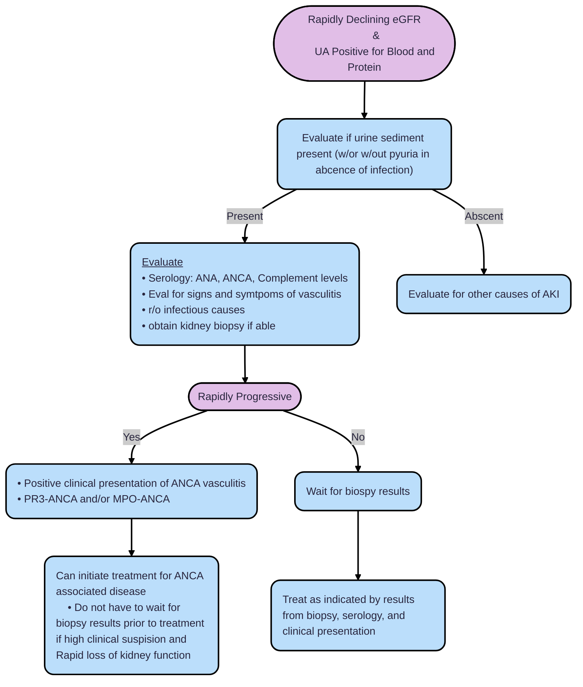
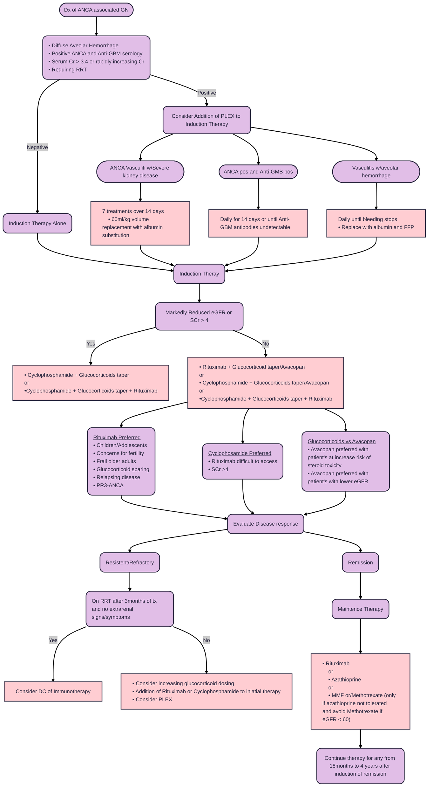

# **Antineutrophil Cytoplasmic Antibody-Associated Vasculitis (ANCA)**
## **Overview**
  * Occurs most often in older patietn's 50 years and older
  * Has ongoing acute injury until complete remission is achieved
  * Four forms of disease presentation: Renal limitted, MPA, GPA, and EGPA
  * Two autoantibodies: PR3-ANCA (proteinase 3) and MPO-ANCA (myeloperodixase)
  * 90% of patient have crescents on kidney biopsy
  * Poor prognosis w/out immunosuppressive therapy
  * ANCA titers should not guide treatment
  * Can recur after kidney transplant
  * Need to have complete clinical remission for 6 months or more pior to kidney transplant
## **Pathophysiology**
  * Small vesculitis: necrotizine inflammation of small vessels and little to no deposition of immune complexes (pauci-immune)
  * Four forms of disease presentation
    1. Renal Limitted Vasculitis (RLV): pauci-immune Crescent GN
    2. Microscopic Polyangitis (MPA): Vasculitis w/no asthma or ganulomas
    3. Granulomatosis w/polyangitis (GPA): Granulomas and no astman
    4. Eosinophilic GPA: eosinophilia, athma, and granulomas
  * Autoantibodies: PR3-ANCA and MPO-ANCA
    1. Both cause same sprectrum of diasea
    2. Organ system distribution and pathologic patterns differ by Antigen specificity
    3. PR3-ANCA more associated with lung involvement
    4. MPO-ANC more associated w/renal limitted involvement
    5. Duel positive patient's consider drug induced ANCA disease
    6. PR3-ANCA positive patients higher relapse rate than MPO-ANCA positive patients
  * Histologic activity unlikely in the abscense of hematuria
    1. Patient's with hematuria more likely to relapse than those w/out, but difference in occurance of kidney failure
  * Four histologic Classes
    1. Focal: 50% or more glomeruli normal 
    2. Crescentic: 50% or more glomerulic have cellular cresents
    3. Sclerotic: 50% or more glomeruli globally sclerotic
    4. Mixed: does not fit any of the above classifications
### Cresentic GN
 * Cresents are etiologically and pathogenically a nonspecific response to glomerular capilary rupture that is typically caused by inflammmatory injury
 * Types: Cellular, fibrocellular, fibrous, and pseudocrescent
   1. Higher number of fibrous cresents present on biopsy--> less likely to have recovery
 * Cresentic lesions can be found on wide range of GN with varying percentages of glomerulus
 * Anti-GBM and ANCA vasculitis are considered "rapidly progressive cresentic gn". Both of which are typically severe and agressive with greater than 50% Crescents found on light microscopy
## **Clinical Presentation**
  * Signs and Symptoms of Vasculitis
    1. Nasal, sinus, and ear disease: sinus pain, chronic rhinosinusitis, nasal obstruction, purulent/bloody nasal discharge, etc
    2. Airway and lung involvement: cough, hemoptsys (alveolar hemorrhage), dyspnea, and pleuritic pain
    4. Skin: purpura, possible focal necrosis and ulceration, etc
    5. Eyes: conjunctivitis, corneal ulceration, retinal vasculitis, uvitis, etc
    6. CNS: mononeuropathy, scranial nerve abnormalitis, sensorineural hearing loss, meningeal disease, etc
  * Renal manifestation
    1. Microscopic hematuria w/dysmorphic RBC
    2. Rapidly declining eGFR
    3. Proteinuria
    4. Persistent Hematuria and proteinuria seen in 50% of patients after treatment
## **Drugs and Diseases Associated with ANCA**
  * Drugs
    1. Hydralazine (frequently high titers of MPO)
    2. Prophylthiouracil (frequently MPO positive)
    3. Minocycline
    4. Cocaine and levamisole (associated with duel positivity with PR3 and MPO)
  * Subacute bacterial endocarditis and other forms of chronic bacteremia demonstrated positivity for ANCA
  * ANCA positivity seening 60-80% of UC patients and patient with primary sclerosing cholangitis
## **Deffinitions of Treatment Response**
  * Disease activity
    1. ANCA-associated vasculitis represented in sings or symtpoms oattributable to active disease in any organ system
  * Remission
    1. The abscense of manifestation of vasculitis and GN
    2. GN: stable or improved eGFR while <ins>hematuria and proteinuria are present at time of active disease and can resolve completely, their persistence does not necessarily imply active disease </ins>
  * Relapse
    1. occurrence of increased disease activity after a period of partial or complete remission
    2. Return or increase of hematuria w/proteinuria may indicate relapse
    3. Major replase: life or organ threating disease (examples include diffuse alveolar hemorrhage, subglottic stenosis, GN, or vascultitis threatening vision)
  * Treatment-resistent Disease
    1. Persistence of or appearance of kidney and/or systemic manifestation of vasculitis, while recieving treatment equal in intensity to induction therapy
  * Factors that increase risk of relapse
    1. Diagnosis of GPA
    2. PR3-ANCA
    3. Lower Serum Cr
    4. More extensive disease
    5. Ear, nose, and throat disease
    6. History of relapse
    7. ANCA positive at end of induction/Rise in ANCA
    8. Lower cyclophosphamide exposure
    9. Immunosuppressive therapy w/drawal
    10. Glucocorticoid w/drawl
## **Evaluation and Treatment**
### Evaluation

### Treatment

### Rituximab Dosing
|Induction|Maintance|
|---------|---------|
|• 375mg/m2/week x 4 weeks|• 500mg x2 at complete remission and 500mg at months 6, 12, and 18|
|or|or|
|• 1g at weeks 0 and 2|• 1g after induction of remission at months 4, 8, 12, 16|
  * Maintance dosing of Rituximab can be based on fixed dosing as listed above or upon reappearance of CD19+ Bcells and/or ANCA
    1. In study groups where Rituximab dosed via CD19+ Bcells levels patients required fewer infusions of rituximab
  * Rituximab preferred for Maintenance therapy
    1. Relapsing disease
    2. PR3-ANCA
    3. Frail older adults
    4. Glucocorticoid-sparing
    5. Azathioprine allergy
### Cyclophosphamide Dosing

|Oral Cyclophosphamide|IV Cyclophosphamide|
|---------------------|-------------------|
|• 2mg/kg/day for 3months|• 15mg/kg at weeks: 0, 2, 4, 7, 10, 13 (16, 19, 21, 24 if required)|
|<ins>Reduction for Age and function</ins>|<ins>Reduction for Age and function</ins>|
| • 60 y/o: 1.5mg/kg/day|• 60 y/o: 12.5mg/kg/day|
| • 70 y/o: 1mg/kg/day| • 70 y/o: 10mg/kg/day|
| • Reduce by 0.5mg/kg/day for eGFR < 30| • Reduce by 2.5mg/kg for eGFR < 30|

### Avacopan
  * 30mg BID as alternative to glucocorticoids in combination w/rituximab or cyclophosphamide 

### Prednisone Taper
|Week|Patient's <50kg|Patient's 50-70kg|Patient's >75kg|
|----|-----|-------|-----|
|1   |50mg |60mg   |75mg |
|2   |25mg |30mg   |40mg |
|3-4|20mg|25mg|30mg|
|5-6|15mg|20mg|25mg|
|7-8|12.5mg|15mg|20mg|
|9-10|10mg|12.5mg|15mg|
|11-12|7.5mg|10mg|12.5mg|
|13-14|5mg|7.5mg|10mg|
|15-16|5mg|5mg|7.5mg|
|17-18|5mg|5mg|7.5mg|
|19-20|5mg|5mg|5mg|
|21-22|5mg|5mg|5mg|
|23-52|5mg|5mg|5mg|
|>52|Investigator's local practice|Investigator's local practice|Investigator's local practice|

### Azatioprine
|Reduced Therapy|Extended Therapy|
|---------------|----------------|
|1.5-2mg/kg/day at complete remission until 1 year after diagnosis|1.5-2mg/kg/day for 18-24months|
|Then decrease by 25mg every 3 months|Then Decrease by 1mg/kg/day until 4 years after diagnosis|
|  | Then taper by 25mg every 3 months|
|  | Glucocorticoids shuld be continue at 5-7.5mg/day for years then slowly reduced by 1mg every 2 months |

## **Sources**
  * [KDIGO Guidlines](https://www.kidney-international.org/action/showPdf?pii=S0085-2538%2823%2900744-5)
  * [Signs and symtpoms of ANCA vascultitis](https://www-uptodate-com.ezproxy.ttuhsc.edu/contents/granulomatosis-with-polyangiitis-and-microscopic-polyangiitis-clinical-manifestations-and-diagnosis?search=signs%20and%20symptoms%20of%20anca%20vasculitis&sectionRank=1&usage_type=default&anchor=H1522363621&source=machineLearning&selectedTitle=1~150&display_rank=1#H2879736833)
  * [Clinical spectrum of ANCA associated Disease](https://www-uptodate-com.ezproxy.ttuhsc.edu/contents/clinical-spectrum-of-antineutrophil-cytoplasmic-autoantibodies?search=drug%20that%20cause%20anca&source=search_result&selectedTitle=2~150&usage_type=default&display_rank=2#H20)
  * [Rituximab as therapy to induce remission after relapse in ANCA vasculitis](https://pubmed.ncbi.nlm.nih.gov/32581088/)
  * [Rituximab bs azathoprine for mainence of remission for patients with relapsing disease](https://pubmed.ncbi.nlm.nih.gov/36958796/)
  * [Rituximab vs cyclophosphamide in ANCA](https://www.nejm.org/doi/full/10.1056/NEJMoa0909169)
  * [ADVOCATE REnal recovery in trial of Avacopan](https://pubmed.ncbi.nlm.nih.gov/37069984/)
  * [Avocopan for treatment of ANCA vasculitis, ADVOCATE](https://www.nejm.org/doi/full/10.1056/NEJMoa2023386)
  * [EULAR recommendation for ANCA 2022 update](https://ard.bmj.com/content/annrheumdis/83/1/30.full.pdf)
  * [Reduced dose vs High dose glucocorticoids added to rituximab on remission of ANCA 2 year follow up](https://pubmed.ncbi.nlm.nih.gov/37734880/)
  * [Randomised controlled Trial of Prolonged tx in the remission phase of ANCA](https://pubmed.ncbi.nlm.nih.gov/28546260/)
  * [PLEX in patient with ANCA vasculitis systemic review](https://www.bmj.com/content/376/bmj-2021-064604)
  * [Plasma exchange in immunosuppression in RPGN](https://pubmed.ncbi.nlm.nih.gov/3289804/)
  * [PLEX and glucocorticoids insevere ANCA vasculitis](https://www.nejm.org/doi/full/10.1056/NEJMoa1803537)
  * [PLEX or high dose methylprednisolone as ajdjunctive therapy for severe renal vasculitis](https://pubmed.ncbi.nlm.nih.gov/17582159/)
  * [Efficacy of remission-induction regimens for ANCA vasculitis](https://www.nejm.org/doi/full/10.1056/NEJMoa1213277)
  * [Effect of rituximab on malignancy risk in pt with ANCA vasculitis](https://pubmed.ncbi.nlm.nih.gov/27899372/)
  * [B cell therapy in ANCA vasculitis](https://pubmed.ncbi.nlm.nih.gov/30108367/)
  * [Glucocorticoid-free maintenance regimen for ANCA vasculitis](https://pubmed.ncbi.nlm.nih.gov/30239910/)
  * [Pulse vs continuouse prednisolone and cyclophosphamide in systemic vasculitis](https://pubmed.ncbi.nlm.nih.gov/9205678/)
  * [MMF w/corticosteroids for induction therapy of microscopic polyangiitis](https://pubmed.ncbi.nlm.nih.gov/21311184/)
  * [Pulse vs daily oral cyclophosphamide for induction of remission of ANCA](https://pubmed.ncbi.nlm.nih.gov/19451574/)
---
*Last updated: 9/2025 by Ashley Kinder, D.O.*
*Next review: 9/2026*
