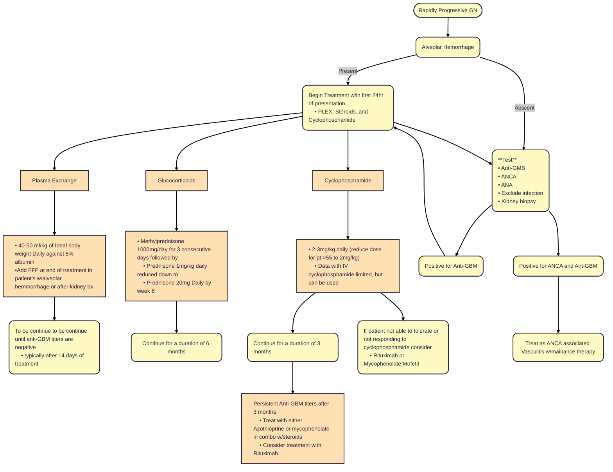

# **Anti-Glomerular Basement Membrane (Anti-GBM)**
## **Overview**
  * Rapidly progressive Crescent GN
    1. 95% of patients present with crescents
  * One wave of acute injury
  * Incidence of 0.5-1 per million
  * Equal Male:Female ratio
  * Most common in Caucasians and older Asians 
  * Occurs as isolated kidney disease or Pulm-renal syndrome (Goodpasture's)
    1. 40-60% of patient have alveolar invovlement --> predomintly young males with pulm and renal involvement
    2. Alveolar involvement more likely with smokers 
  * Biphasic distribution: 20-30's and 60-70
  * Typically do no flair after treatment from disease
     1. If flair occurs should conisder ANCA associated disease
  * Timming of treatment matters --> early treament the better
  * Prior to immunosupression therapy had a 96 mortality rate which has dropped to 47 with immunosupression therapy
    1. This mortality rate drops further for those patient's with pulmonary hemorrhage who recieve Plasmaphoresis and immunotherapy to 8.5% mortality 
  * Disease can re-occur in transplant if ant-gbm titer still detectable
    1. Typically recommend 6 months or more of undetectable anti-gbm levels prior to transplant
## **Pathophysiology**
 * Autoantibody against the non-collagenous domain of the alpha3 chain of type IV collagen which can be found in the glomerlous and the alveoli 
   1. With alveolar hemorrhage: Goodpasture Syndrome
   2. W/out alveolar hemorrhage: Anti-GBM GN
 * Pathology: Linear staining for IgG or rarely IgA on IM
 * Alloimune ANti-GBM: patients w/type 4 collagen mutation recieve a kidney transplant from done w/out mutation: Antibodies form against GBM of transplanted kidney (typically occurs in some genetic variation of Alport syndrome)
### Cresentic GN
 * Cresents are etiologically and pathogenically a nonspecific response to glomerular capilary rupture that is typically caused by inflammmatory injury
 * Types: Cellular, fibrocellular, fibrous, and pseudocrescent
   1. Higher number of fibrous cresents present on biopsy--> less likely to have recovery
 * Cresentic lesions can be found on wide range of GN with varying percentages of glomerulus
 * Anti-GBM and ANCA vasculitis are considered "rapidly progressive cresentic gn". Both of which are typically severe and agressive with greater than 50% Crescents found on light microscopy
## **Clinical Presentation**
 * Hematuria/Proteinuria 
 * W/ or w/out alveolar hemorrhage: dignosed clinical or with high resolution CT
 * Rapidly rising Cr/Dropping eGFR: rapidly crescent GN
## **Treatment**

 * Most Anti-GBM is cleared in the first 8 weeks of treatment after PLEX and Immunsupression initiated
 * Relapses uncommon --> may occure in patient who smoke or are exposed to lun irritants
 * If serious infection during treatment can add IVIG post PLEX treatment with abx
 * [Prophylaxis](Prophylaxis.md)
## **Sources**
* [KDIGO GN Guidlines](https://kdigo.org/guidelines/gd/)
* [Long-term outcome of Anti-GM treated with immunoadsorption](https://journals.plos.org/plosone/article?id=10.1371/journal.pone.0103568)
* [Anti-GBM uncommon cause of ESRD](https://www.sciencedirect.com/science/article/pii/S0085253815557487)
* [Anti-GBM treated with MMF, steroids, and PLEX](https://www.dustri.com/article_response_page.html?artId=9452&doi=10.5414/CN107333&L=0)
* [Successful tx of resisteant anti-gbm w/ Mycophenolic acid](https://www.scopus.com/pages/publications/77950666341)
* [Goodpasture's treated with Mycophenolate](https://www.scopus.com/pages/publications/0034067486)
* [Rituximab as induction therapy in anti-gbm](https://www.scopus.com/pages/publications/85055132914)
* [Retrospective study of Rituximab in anti-gbm](https://www.sciencedirect.com/science/article/abs/pii/S0896841115000566)
* [Chronic recurrent Goodpasture's](https://www.sciencedirect.com/science/article/abs/pii/0002934387900246)
* [Outcomes of Goodpassture's with PLEX](https://www.sciencedirect.com/science/article/abs/pii/S0896841116300762)
* [Long-Term Outcome of Anti-GBM treated w/PLEX and immunosupression](https://www.acpjournals.org/doi/10.7326/0003-4819-134-11-200106050-00009)
* [Clinical and immunological evoluation of oligoanuric anti-gbm treated by Haemodialysis](https://www.sciencedirect.com/science/article/abs/pii/S0140673686918933)
* [Anti-GMB Disease](https://journals.lww.com/jasn/fulltext/1999/11000/anti_glomerular_basement_membrane_disease.23.aspx)
* [Recovery from Goodpasture's after immunosupression and PLEX](https://www.bmj.com/content/2/5965/252)
* [Alveolar Hemorrhage in Anti-GBM disease, Cases](https://journals.lww.com/md-journal/fulltext/2007/05000/alveolar_hemorrhage_in_anti_basement_membrane.6.aspx)
* [Cigarette smoking and lung haemorrhage in anti-gbm disease](https://www.sciencedirect.com/science/article/abs/pii/S0140673683909236)
* [Predictors of renal and patient outcomes in anti-gbm](https://academic.oup.com/ndt/article-abstract/30/5/814/2332858?redirectedFrom=fulltext)
* [Analysis of prognostic significance of clinical, pathologic, and treatment factors in anti-gbm therapy](https://journals.lww.com/md-journal/citation/1985/07000/therapy_of_anti_glomerular_basement_membrane.3.aspx)
* [Predicting Outcomes in patients with anti-gbm](https://journals.lww.com/cjasn/fulltext/2018/01000/predicting_outcome_in_patients_with_anti_gbm.13.aspx)
* [Prognostic factors in anti-gbm](https://www.scopus.com/pages/publications/85069433050)
* [Goodpasture's disease and absence of anti-gbm antibodies](https://www.sciencedirect.com/science/article/abs/pii/S0272638602104446)
* [Clinical features and outcomes of patients w/both ANCA and anti-gbm](https://www.sciencedirect.com/science/article/pii/S0085253815502226)
* [ANCA and anti-gbm positive: renal survival, frequency of relapse, and outcomes](https://www.sciencedirect.com/science/article/pii/S0085253817302077)

---
*Last updated: 9/2025 by Ashley Kinder, D.O.*
*Next review: 9/2026*
