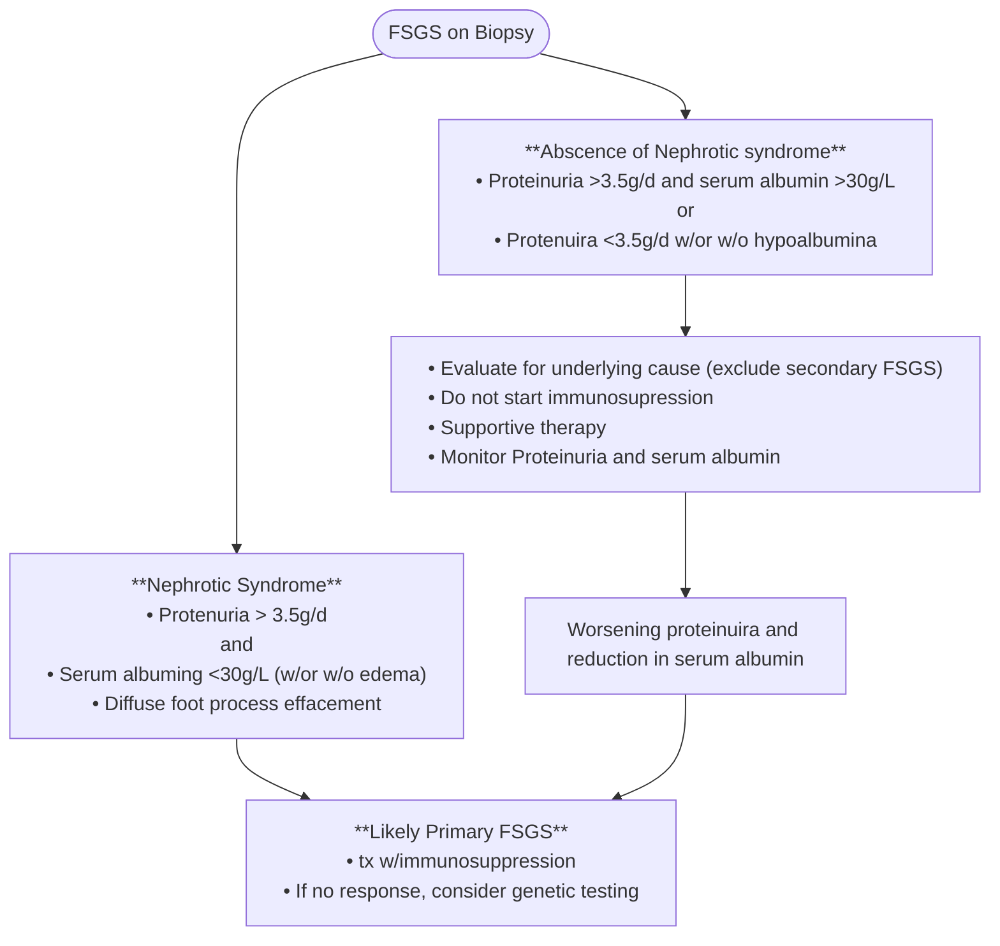
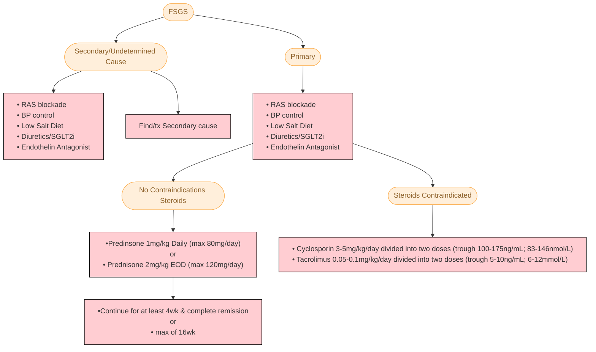
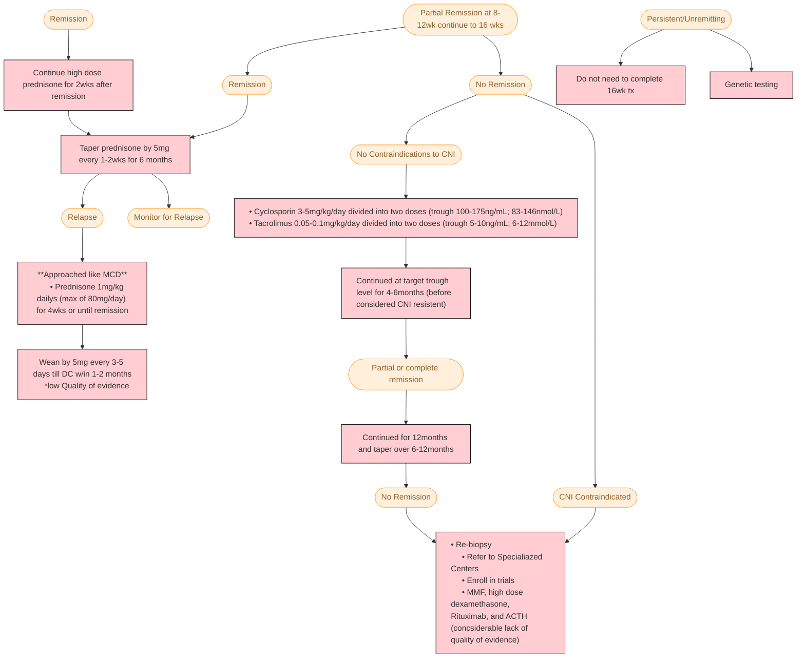

# **Focal Segmental Glomerulosclerosis (FSGS)** 
## **Overview**
  * Most common cause of Nephrotic Syndrome in U.S.
  * Three types: Idiopathic, Secondary, and Genetic
  * Idiopathic can reoccur in transplant patients (typically rapid course in the first months)
  * Patient's with APOL1 varient: increased incidence of FSGS typical lesions and collapsing lesions 
## **Pathophysiology** 
  * Primary: Circulating permeability factors yet to identified
     1. Pathology: Focal segmental glomerulosclerosis and foot process effacement (may be diffuse or variable)
     2. Re-occurs in transplant patients
     3. Responds to plasmapheresis in transplant patient
  * Secondary: has a known cause
     1. Pathology: FSGS lesions, with or without  foot process effacement
     2. Adaptive changes to glomerular hyperfiltration typicallly in the setting of reduced nephron mass (low birth weight, reflux nephropathy, renal dysplasia secondary to other renal disease)
     3. Direct podocyte injury: HIV, Parvo, ect. 
  * Genetic
     1. Mutations in podocyte or glomular basement membrane
     2. Not routinely tested in adults
     3. Should be considered in adults resistant to steroid therapy
     4. Patient's with APOL1 are more susceptible to develop FSGS lesions
  * MCD (Minimal Change Disease) vs FSGS
     1. Both have foot process effacement
     2. FSGS: presence of segmental sclerosis and early findings demonstrate tubulointerstitial fibrosis and glomerular hypertrophy 
  * Circulating factors currently under investigation for primary FSGS
     1. Anti-Nephrin Ab
     2. SuPAR (not specific  for FSGS)
     3. Cardiotrophine-like cytokine 
## **Clinical Presentation**
  * Proteniuria > 3.5g/d
  * Hypoalbuminemia <30g/L
  * Dyslipidemia
  * Edema/signs of volume overload
## **Primary vs Secondary**

### **Genetic testing consideration**
  * Younger patients with FSGS
  * Patients w/family members w/FSGS
  * FSGS patients resistent to therapy
  * Benefits of Genetic testing: avoid immunosuppressives, guide tx for transplant (who can donate), guide for recurrence
## **Drugs and Disease Associated with FSGS**
  * Infectious
    1. HIV
    2. Parvo B19
    3. CMV
    4. COVID 19
  * Adapative
    1. Low nephron mass (low birth weight, surgical removal)
    2. Obesity 
    3. Remnant kidney
    4. Diabetic Nephropahty
    5. Reflux Nephropathy
    6. Oligomeganephronia
  * Drugs
    1. Interferon
    2. Pamidronate
    3. Anabolic steroids
    4. CNI
    5. NSAIDs
    6. Lithium
    7. DAAV (direct acting anti-viral)
    8. mTORs
    9. Heroin
## **Definitions of Treatment Response**
  * Complete remission
     1. Reduction of proteinuria to <0.3g/d or PCR <300mg/d (or 30mg/mmol)
     2. Stable serum Creatinine
     3. Serum albumin >3.5 g/dL (or 35g/L)
  * Partial Remission
     1. Reduction of proteinuria to 0.3-3.5g/d or PCR 300-3500mg/g (or 30-350mg/mmol)
     2. Decrease greaterthan 50% from baseline
  * Relapse
     1. Proteinuria of >3.5g/d or PCR >3500mg/d (or 350mg/mmol) after complete remission achieved
     2. Increase in proteinuria by >50% during partial remission
  * Steroid-resistand FSGS
     1. Persistence of proteinuria >3.5g/d or PCR >3500mg/d (or 350mg/mmol) w/<50% reduction from baseline despite adequate dosing of prednisone for at least 16 wks
  * Steroid-dependent FSGS
    1. Relapse occuring during or w/in 2wk of completing glucocorticoid therapy
  * CNI-resistent FSGS
    1. Persistence of proteinuria >3.5g/d or PCR >3500mg/d (or 350mg/mmol) w/<50% reduction from baseline despite treatment with cyclosporine/tacrolimus with trough levels at goal ranges
  * CNI-dependent FSGS
    1. Relapse occuring during or w/in 2wks of completeing cyclosporine/tacrolimus therapy for >12mo
## **Treatment**
### **Initial treatment**

### **Treatment response**

### Other considerations
  * Rituximab
     1. Emerging as a secondline therapy
     2. Consider in patients with multiple Treatment failures
     3. Consider using Rituximab +/- CNI
  * Endothelin Blockade: Sparsent vs Irbesartan pending FDA approval --> Reduction in UPCR
## **Sources** 
* [KDIGO GN Guidlines](https://kdigo.org/guidelines/gd/)
* [CNI w/Reduced-dose steroids as firstline therpay for FSGS](https://pubmed.ncbi.nlm.nih.gov/30596167/)
* [Long-Term Outcoms of Rituxiimab-treated Adul Patients w/Podocytopathies](https://pubmed.ncbi.nlm.nih.gov/39431468/)
* [Treatment of primary FSGS in adults](https://www.scopus.com/pages/publications/84868624922)
* [Recurrence of FSGS after Kidney Transplant in Adults](https://journals.lww.com/cjasn/pages/articleviewer.aspx?year=2020&issue=02000&article=00014&type=Fulltext)
* [Efficacy and Safety of Sparsentan in patients with FSGS](https://journals.lww.com/jasn/fulltext/2018/11000/duet__a_phase_2_study_evaluating_the_efficacy_and.17.aspx)
* [Differentiating primary, genetic, and secondary FSGS in adults](https://journals.lww.com/jasn/fulltext/2018/03000/differentiating_primary,_genetic,_and_secondary.8.aspx)
* [FSGS clincal trial on treatment of steroid-resistant FSGS](https://academic.oup.com/ndt/article-abstract/28/3/527/1815080?redirectedFrom=fulltext)

---
*Last updated: 9/2025 by Ashley Kinder, D.O.*
*Next review: 9/2026*
