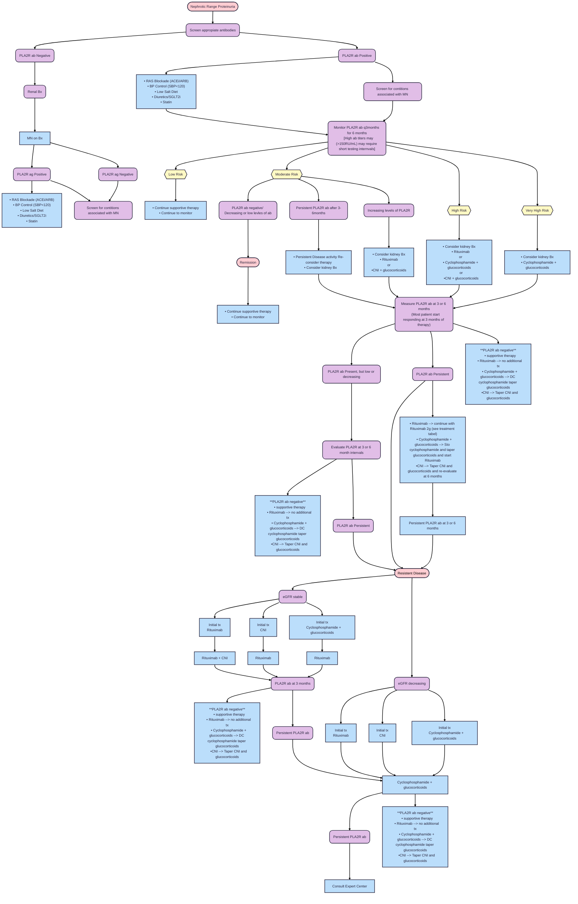

Fullchart

```mermaid
---
config:
  theme: redux
---
flowchart TD
    A(["Nephrotic Range Proteinuria"]) --> B["Screen appropiate antibodies"]
    B --> C["PLA2R ab Negative"] & D["PLA2R ab Positive"]
    C --> n1["Renal Bx"]
    n1 --> n2["MN on Bx"]
    n2 --> n3["PLA2R ag Positive"] & n4["PLA2R ag Negative"]
    n4 --> n5["Screen for contitions associated with MN"]
    n3 --> n6["• RAS Blockade (ACEi/ARB)
    • BP Control (SBP&lt;120)
    • Low Salt Diet
    • Diuretics/SGLT2i
    • Statin"] & n5
    D --> n7["• RAS Blockade (ACEi/ARB)
    • BP Control (SBP&lt;120)
    • Low Salt Diet
    • Diuretics/SGLT2i
    • Statin"] & n8["Screen for contitions associated with MN"]
    n7 --> n9["Monitor PLA2R ab q3months for 6 months
    [High ab titers may (>150RU/mL) may require short testing internvals]"]
    n8 --> n9
    n9 --> n10["Low Risk"] & n11["Moderate Risk"] & n12["High Risk"] & n13["Very High Risk"]
    n11 --> n15["PLA2R ab negative/ Decreasing or low levles of ab"] & n16["Persistent PLA2R ab after 3-6months"] & n17["Increasing levels of PLA2R"]
    n12 --> n18["• Consider kidney Bx
    • Rituximab 
    or 
    • Cyclophosphamide + glucocorticoids
    or
    •CNI + glucocorticoids"]
    n13 --> n19["• Consider kidney Bx
    • Cyclophosphamide + glucocorticoids"]
    n17 --> n20["• Consider kidney Bx
    • Rituximab 
    or
    •CNI + glucocorticoids"]
    n15 --> n21(["Remission"])
    n16 --> n22["• Persistent Disease activity Re-consider therapy
    • Consider kidney Bx"]
    n21 --> n23["• Continue supportive therapy
    • Continue to monitor"]
    n18 --> n24["Measure PLA2R ab at 3 or 6 months
    (Most patient start responding at 3 months of therapy)"]
    n19 --> n24
    n22 --> n24
    n20 --> n24
    n24 --> n26["PLA2R ab Present, but low or decreasing"] & n27["PLA2R ab Persistent"] & n28["**PLA2R ab negative**
    • supportive therapy
    • Rituximab --> no additional tx
    • Cyclophosphamide + glucocorticoids --> DC cyclophosphamide taper glucocorticoids
    •CNI --> Taper CNI and glucocorticoids"]
    n26 --> n29["Evaluate PLA2R at 3 or 6 month intervals"]
    n29 --> n30["**PLA2R ab negative**
    • supportive therapy
    • Rituximab --> no additional tx
    • Cyclophosphamide + glucocorticoids --> DC cyclophosphamide taper glucocorticoids
    •CNI --> Taper CNI and glucocorticoids"] & n31["PLA2R ab Persistent"]
    n31 --> n32(["Resistent Disease"])
    n32 --> n54["eGFR stable"] & n55["eGFR decreasing"]
    n54 --> n57["Initial tx 
    Rituximab"] & n58["Initial tx
    CNI"] & n59["Initial tx
    Cyclosphosphamide + glucocorticoids"]
    n55 --> n60["Initial tx
    Rituximab"] & n61["Initial tx
    CNI"] & n62["Initial tx
    Cyclosphosphamide + glucocorticoids"]
    n57 --> n63["Rituximab + CNI"]
    n58 --> n64["Rituximab"]
    n59 --> n65["Rituximab"]
    n60 --> n66["Cyclosphosphamide + glucocorticoids"]
    n61 --> n66
    n62 --> n66
    n63 --> n67["PLA2R ab at 3 months"]
    n64 --> n67
    n65 --> n67
    n67 --> n70["**PLA2R ab negative**
    • supportive therapy
    • Rituximab --> no additional tx
    • Cyclophosphamide + glucocorticoids --> DC cyclophosphamide taper glucocorticoids
    •CNI --> Taper CNI and glucocorticoids"] & n71["Persistent PLA2R ab"]
    n66 --> n68["Persistent PLA2R ab"] & n72["**PLA2R ab negative**
    • supportive therapy
    • Rituximab --> no additional tx
    • Cyclophosphamide + glucocorticoids --> DC cyclophosphamide taper glucocorticoids
    •CNI --> Taper CNI and glucocorticoids"]
    n68 --> n69["Consult Expert Center"]
    n71 --> n66
    n27 --> n32 & n73["• Rituximab --> continue with Rituximab 2g (see treatment tabel)
    • Cyclophosphamide + glucocorticoids --> Sto cyclophosphamide and taper glucocorticoids and start Rituximab
    •CNI --> Taper CNI and glucocorticoids and re-evaluate at 6 months"]
    n73 --> n74["Persistent PLA2R ab at 3 or 6 months"]
    n74 --> n32
    n10 --> n75["• Continue supportive therapy
    • Continue to monitor"]
    B@{ shape: rounded}
    C@{ shape: rounded}
    D@{ shape: rounded}
    n1@{ shape: rounded}
    n3@{ shape: rounded}
    n4@{ shape: rounded}
    n5@{ shape: rounded}
    n8@{ shape: rounded}
    n9@{ shape: rounded}
    n10@{ shape: hex}
    n11@{ shape: hex}
    n12@{ shape: hex}
    n13@{ shape: hex}
    n15@{ shape: rounded}
    n16@{ shape: rounded}
    n17@{ shape: rounded}
    n24@{ shape: rounded}
    n26@{ shape: rounded}
    n27@{ shape: rounded}
    n29@{ shape: rounded}
    n31@{ shape: rounded}
    n54@{ shape: rounded}
    n55@{ shape: rounded}
    n67@{ shape: rounded}
    n71@{ shape: rounded}
    n68@{ shape: rounded}
    style A fill:#FFCDD2
    style B fill:#E1BEE7
    style C fill:#E1BEE7
    style D fill:#E1BEE7
    style n1 fill:#E1BEE7
    style n2 fill:#BBDEFB
    style n3 fill:#E1BEE7
    style n4 fill:#E1BEE7
    style n5 fill:#E1BEE7
    style n6 fill:#BBDEFB
    style n7 fill:#BBDEFB
    style n8 fill:#E1BEE7
    style n9 fill:#E1BEE7
    style n10 fill:#FFF9C4
    style n11 fill:#FFF9C4
    style n12 fill:#FFF9C4
    style n13 fill:#FFF9C4
    style n15 fill:#E1BEE7
    style n16 fill:#E1BEE7
    style n17 fill:#E1BEE7
    style n18 fill:#BBDEFB
    style n19 fill:#BBDEFB
    style n20 fill:#BBDEFB
    style n21 fill:#FFCDD2
    style n22 fill:#BBDEFB
    style n23 fill:#BBDEFB
    style n24 fill:#E1BEE7
    style n26 fill:#E1BEE7
    style n27 fill:#E1BEE7
    style n28 fill:#BBDEFB
    style n29 fill:#E1BEE7
    style n30 fill:#BBDEFB
    style n31 fill:#E1BEE7
    style n32 color:#000000,fill:#FFCDD2
    style n54 fill:#E1BEE7
    style n55 fill:#E1BEE7
    style n57 fill:#BBDEFB
    style n58 fill:#BBDEFB
    style n59 fill:#BBDEFB
    style n60 fill:#BBDEFB
    style n61 fill:#BBDEFB
    style n62 fill:#BBDEFB
    style n63 fill:#BBDEFB
    style n64 fill:#BBDEFB
    style n65 fill:#BBDEFB
    style n66 fill:#BBDEFB
    style n67 fill:#E1BEE7
    style n70 fill:#BBDEFB
    style n71 fill:#E1BEE7
    style n68 fill:#E1BEE7
    style n72 fill:#BBDEFB
    style n69 fill:#BBDEFB
    style n73 fill:#BBDEFB
    style n74 fill:#BBDEFB
    style n75 fill:#BBDEFB
```
