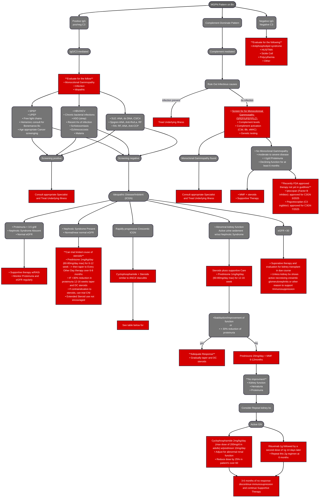

# Membranous

```mermaid
---
config:
  theme: redux
---
flowchart TD
    A(["Nephrotic Range Proteinuria"]) --> B["Screen appropiate antibodies"]
    B --> C["PLA2R ab Negative"] & D["PLA2R ab Positive"]
    C --> n1["Renal Bx"]
    n1 --> n2["MN on Bx"]
    n2 --> n3["PLA2R ag Positive"] & n4["PLA2R ag Negative"]
    n4 --> n5["Screen for contitions associated with MN"]
    n3 --> n6["• RAS Blockade (ACEi/ARB)
    • BP Control (SBP&lt;120)
    • Low Salt Diet
    • Diuretics/SGLT2i
    • Statin"] & n5
    D --> n7["• RAS Blockade (ACEi/ARB)
    • BP Control (SBP&lt;120)
    • Low Salt Diet
    • Diuretics/SGLT2i
    • Statin"] & n8["Screen for contitions associated with MN"]
    n7 --> n9["Monitor PLA2R ab q3months for 6 months
    [High ab titers may (>150RU/mL) may require short testing internvals]"]
    n8 --> n9
    n9 --> n10["Low Risk"] & n11["Moderate Risk"] & n12["High Risk"] & n13["Very High Risk"]
    n11 --> n15["PLA2R ab negative/ Decreasing or low levles of ab"] & n16["Persistent PLA2R ab after 3-6months"] & n17["Increasing levels of PLA2R"]
    n12 --> n18["• Consider kidney Bx
    • Rituximab 
    or 
    • Cyclophosphamide + glucocorticoids
    or
    •CNI + glucocorticoids"]
    n13 --> n19["• Consider kidney Bx
    • Cyclophosphamide + glucocorticoids"]
    n17 --> n20["• Consider kidney Bx
    • Rituximab 
    or
    •CNI + glucocorticoids"]
    n15 --> n21(["Remission"])
    n16 --> n22["• Persistent Disease activity Re-consider therapy
    • Consider kidney Bx"]
    n21 --> n23["• Continue supportive therapy
    • Continue to monitor"]
    n18 --> n24["Measure PLA2R ab at 3 or 6 months
    (Most patient start responding at 3 months of therapy)"]
    n19 --> n24
    n22 --> n24
    n20 --> n24
    n24 --> n26["PLA2R ab Present, but low or decreasing"] & n27["PLA2R ab Persistent"] & n28["**PLA2R ab negative**
    • supportive therapy
    • Rituximab --> no additional tx
    • Cyclophosphamide + glucocorticoids --> DC cyclophosphamide taper glucocorticoids
    •CNI --> Taper CNI and glucocorticoids"]
    n26 --> n29["Evaluate PLA2R at 3 or 6 month intervals"]
    n29 --> n30["**PLA2R ab negative**
    • supportive therapy
    • Rituximab --> no additional tx
    • Cyclophosphamide + glucocorticoids --> DC cyclophosphamide taper glucocorticoids
    •CNI --> Taper CNI and glucocorticoids"] & n31["PLA2R ab Persistent"]
    n31 --> n32(["Resistent Disease"])
    n32 --> n54["eGFR stable"] & n55["eGFR decreasing"]
    n54 --> n57["Initial tx 
    Rituximab"] & n58["Initial tx
    CNI"] & n59["Initial tx
    Cyclosphosphamide + glucocorticoids"]
    n55 --> n60["Initial tx
    Rituximab"] & n61["Initial tx
    CNI"] & n62["Initial tx
    Cyclosphosphamide + glucocorticoids"]
    n57 --> n63["Rituximab + CNI"]
    n58 --> n64["Rituximab"]
    n59 --> n65["Rituximab"]
    n60 --> n66["Cyclosphosphamide + glucocorticoids"]
    n61 --> n66
    n62 --> n66
    n63 --> n67["PLA2R ab at 3 months"]
    n64 --> n67
    n65 --> n67
    n67 --> n70["**PLA2R ab negative**
    • supportive therapy
    • Rituximab --> no additional tx
    • Cyclophosphamide + glucocorticoids --> DC cyclophosphamide taper glucocorticoids
    •CNI --> Taper CNI and glucocorticoids"] & n71["Persistent PLA2R ab"]
    n66 --> n68["Persistent PLA2R ab"] & n72["**PLA2R ab negative**
    • supportive therapy
    • Rituximab --> no additional tx
    • Cyclophosphamide + glucocorticoids --> DC cyclophosphamide taper glucocorticoids
    •CNI --> Taper CNI and glucocorticoids"]
    n68 --> n69["Consult Expert Center"]
    n71 --> n66
    n27 --> n32 & n73["• Rituximab --> continue with Rituximab 2g (see treatment tabel)
    • Cyclophosphamide + glucocorticoids --> Sto cyclophosphamide and taper glucocorticoids and start Rituximab
    •CNI --> Taper CNI and glucocorticoids and re-evaluate at 6 months"]
    n73 --> n74["Persistent PLA2R ab at 3 or 6 months"]
    n74 --> n32
    n10 --> n75["• Continue supportive therapy
    • Continue to monitor"]
    B@{ shape: rounded}
    C@{ shape: rounded}
    D@{ shape: rounded}
    n1@{ shape: rounded}
    n3@{ shape: rounded}
    n4@{ shape: rounded}
    n5@{ shape: rounded}
    n8@{ shape: rounded}
    n9@{ shape: rounded}
    n10@{ shape: hex}
    n11@{ shape: hex}
    n12@{ shape: hex}
    n13@{ shape: hex}
    n15@{ shape: rounded}
    n16@{ shape: rounded}
    n17@{ shape: rounded}
    n24@{ shape: rounded}
    n26@{ shape: rounded}
    n27@{ shape: rounded}
    n29@{ shape: rounded}
    n31@{ shape: rounded}
    n54@{ shape: rounded}
    n55@{ shape: rounded}
    n67@{ shape: rounded}
    n71@{ shape: rounded}
    n68@{ shape: rounded}
    style A fill:#FFCDD2
    style B fill:#E1BEE7
    style C fill:#E1BEE7
    style D fill:#E1BEE7
    style n1 fill:#E1BEE7
    style n2 fill:#BBDEFB
    style n3 fill:#E1BEE7
    style n4 fill:#E1BEE7
    style n5 fill:#E1BEE7
    style n6 fill:#BBDEFB
    style n7 fill:#BBDEFB
    style n8 fill:#E1BEE7
    style n9 fill:#E1BEE7
    style n10 fill:#FFF9C4
    style n11 fill:#FFF9C4
    style n12 fill:#FFF9C4
    style n13 fill:#FFF9C4
    style n15 fill:#E1BEE7
    style n16 fill:#E1BEE7
    style n17 fill:#E1BEE7
    style n18 fill:#BBDEFB
    style n19 fill:#BBDEFB
    style n20 fill:#BBDEFB
    style n21 fill:#FFCDD2
    style n22 fill:#BBDEFB
    style n23 fill:#BBDEFB
    style n24 fill:#E1BEE7
    style n26 fill:#E1BEE7
    style n27 fill:#E1BEE7
    style n28 fill:#BBDEFB
    style n29 fill:#E1BEE7
    style n30 fill:#BBDEFB
    style n31 fill:#E1BEE7
    style n32 color:#000000,fill:#FFCDD2
    style n54 fill:#E1BEE7
    style n55 fill:#E1BEE7
    style n57 fill:#BBDEFB
    style n58 fill:#BBDEFB
    style n59 fill:#BBDEFB
    style n60 fill:#BBDEFB
    style n61 fill:#BBDEFB
    style n62 fill:#BBDEFB
    style n63 fill:#BBDEFB
    style n64 fill:#BBDEFB
    style n65 fill:#BBDEFB
    style n66 fill:#BBDEFB
    style n67 fill:#E1BEE7
    style n70 fill:#BBDEFB
    style n71 fill:#E1BEE7
    style n68 fill:#E1BEE7
    style n72 fill:#BBDEFB
    style n69 fill:#BBDEFB
    style n73 fill:#BBDEFB
    style n74 fill:#BBDEFB
    style n75 fill:#BBDEFB
```

MPGN/C3GN

```mermaid
---
config:
  theme: redux
---
flowchart TD
    A(["MGPN Pattern on Bx"]) --> n1["Positive IgG
    pos/neg C3"] & n2["Complement Dominate Pattern"] & n3["Negative IgG
    Negative C3"]
    n1 --> n4(["IgG/C3 mediated"])
    n2 --> n6(["Complement mediated"])
    n3 --> n7["**Evaluate for the following**
    • Antiphospholipid syndrome
    • HUS/TMA
    • Sickle Cell
    • Polycythemia
    • Other"]
    n6 --> n8["Rule Out Infectious causes"]
    n4 --> n9["**Evaluate for the follow**
    • Monocolonal Gammopathy
    • Infection
    • Idopathic"]
    n9 --> n10["• SPEP
• UPEP
• Free light chains
• Heme/onc consult for Bonemarow Bx
• Age appropriate Cancer screenging"] & n11["• HBV/HCV
• Chronic bacterial infections
• ASO (strep)
• Recent Hx of infection
• Schistosomiasis
• Echinococcosis
• Malaria"] & n12["• SLE: ANA, ds DNA, C3/C4
    • Sjogren ANA, Anti-Ro/La, RF
    • RA: RF, ANA, Anti-CCP"]
    n8 -- infection present --> n23["Treat Underlying Illness"]
    n8 -- no infection --> n24["• <ins>Screen for for Monocolonoal Gammopathy (SPEP/UPEP/FLC) </ins>
    • Complement levels
    • Compliment activation (C3d, Bb, sMAC)
    • Genetic testing"]
    n10 --> n17(["Screening positive"]) & n20(["Screening negative"])
    n11 --> n17 & n20
    n12 --> n17 & n20
    n17 --> n21["Consult appropriate Specialist and Treat Underlying Illness"]
    n20 --> n22(["Ideopathic Disease/Indolent (ICGN)"])
    n22 --> n25["• Proteinuria &lt; 3.5 g/dl
     • Nephrotic Syndrome Abscent
     • Normal eGFR"] & n26["• Nephrotic Syndrome Present
     • Normal/near normal eGFR"] & n27["• Abnomral kidney function
      Active urine sedement w/out Nephrotic Syndrome"] & n28["Rapidly progressive Crescentic ICGN"] & n29["eGFR &lt;30"]
    n24 --> n30["• No Monoclonal Gammopathy
    • moderate to severe disease
    • >1g/d Proteinuria
    • Declining function for at least 6 months"] & n31(["Monoclonal Gammopathy found"])
    n31 --> n32["Consult appropriate Specialist and Treat Underlying Illness"]
    n30 --> n33["• MMF + steroids
    • Supportive Therapy"] & n34["**Recently FDA approved therapy not yet in guidlines**
    • Iptocopan (Factor B inhibtor): approved for C3GN 3/2025
    • Pegcetocoplan (C3 ingibitor): approved for C3GN 7/2025"]
    n25 --> n35["• Supportive therapy w/RASi
    • Monitor Proteinuria and eGFR regularly"]
    n26 --> n36["**Can trial limited couse of steroids**
    • Prednisone 1mg/kg/day (60-80mg/day max) for 6-12 week --&gt; then taper to Every Other Day therapy over 6-8 months
    • IF &lt;30% reduction in proteinuria 12-16 weeks taper and DC steroids
    • If contraindication to steroids, can trial CNI
    • Extended Steroid use not encouraged"]
    n27 --> n37["Steroids pluss supportive Care
    • Prednisone 1mg/kg/day (60-80mg/day max) for 12-16 week"]
    n28 --> n38["Cyclophosphamide + Steroids similar to ANCA Vasculitis"]
    n29 --> n39["• Suporative therapy and evaluation for kidney transplant in due course
    • Unless kidney bx shows active necrotizing cresentic glomerulonephritis or other reason to support Immunosuppression"]
    n38 --> n40["See table below for"]
    n37 --> n41["•Stabilaztion/improvement of function
     or
    • > 30% reduction of proteinuria"]
    n41 -- yes --> n43["**Adequate Response**
    • Gradually taper and DC steroids"]
    n41 -- No --> n44["Prednisone 20mg/day + MMF 6-12months"]
    n44 --> n45["**No improvment**
    • Kidney function
    • Hematuria
    • Proteinuria"]
    n45 --> n46["Consider Repeat kidney bx"]
    n46 --> n47(["Active GN"])
    n47 --> n48@{ label: "Cyclophosphamide 2mg/kg/day (max dose of 200mg/d in adults) w/prednison 10mg/day\n    • Adjust for abnormal renal function\n    • Reduce dose by 25% in patient's over 60" } & n49["Rituximab 1g followed by a second dose of 1g 14 days later
    • Repeat this 2g regimen at 6 months"]
    n48 --> n50["3-6 months of no response discontinue immunosupression and continue Supportive Therapy"]
    n49 --> n50
    n1@{ shape: rounded}
    n2@{ shape: rounded}
    n3@{ shape: rounded}
    n8@{ shape: rounded}
    n10@{ shape: rounded}
    n11@{ shape: rounded}
    n12@{ shape: rounded}
    n25@{ shape: rounded}
    n26@{ shape: rounded}
    n27@{ shape: rounded}
    n28@{ shape: rounded}
    n29@{ shape: rounded}
    n30@{ shape: rounded}
    n41@{ shape: rounded}
    n43@{ shape: rect}
    n45@{ shape: rounded}
    n46@{ shape: rounded}
    n48@{ shape: rect}
    style A fill:#616161,color:#FFFFFF
    style n1 fill:#757575,color:#FFFFFF
    style n2 fill:#757575,color:#FFFFFF
    style n3 fill:#757575,color:#FFFFFF
    style n4 fill:#757575,color:#FFFFFF
    style n6 fill:#757575,color:#FFFFFF
    style n7 fill:#D50000,color:#FFFFFF
    style n8 fill:#757575,color:#FFFFFF
    style n9 fill:#D50000,color:#FFFFFF
    style n10 fill:#757575,color:#FFFFFF
    style n11 color:#FFFFFF,fill:#757575
    style n12 fill:#757575,color:#FFFFFF
    style n23 fill:#D50000,color:#FFFFFF
    style n24 fill:#D50000,color:#FFFFFF
    style n17 fill:#757575,color:#FFFFFF
    style n20 fill:#757575,color:#FFFFFF
    style n21 color:#FFFFFF,fill:#D50000
    style n22 fill:#757575,color:#FFFFFF
    style n25 fill:#757575,color:#FFFFFF
    style n26 fill:#757575,color:#FFFFFF
    style n27 fill:#757575,color:#FFFFFF
    style n28 fill:#757575,color:#FFFFFF
    style n29 fill:#757575,color:#FFFFFF
    style n30 color:#FFFFFF,fill:#757575
    style n31 fill:#757575,color:#FFFFFF
    style n32 fill:#D50000,color:#FFFFFF
    style n33 fill:#D50000,color:#FFFFFF
    style n34 fill:#D50000,color:#FFFFFF
    style n35 fill:#D50000,color:#FFFFFF
    style n36 fill:#D50000,color:#FFFFFF
    style n37 fill:#D50000,color:#FFFFFF
    style n38 fill:#D50000,color:#FFFFFF
    style n39 fill:#D50000,color:#FFFFFF
    style n40 fill:#D50000,color:#FFFFFF
    style n41 fill:#757575,color:#FFFFFF
    style n43 fill:#D50000,color:#FFFFFF
    style n44 color:#FFFFFF,fill:#D50000
    style n45 fill:#757575,color:#FFFFFF
    style n46 fill:#757575,color:#FFFFFF
    style n47 fill:#757575,color:#FFFFFF
    style n48 color:#FFFFFF,fill:#D50000
    style n49 color:#FFFFFF,fill:#D50000
    style n50 fill:#D50000,color:#FFFFFF
```
