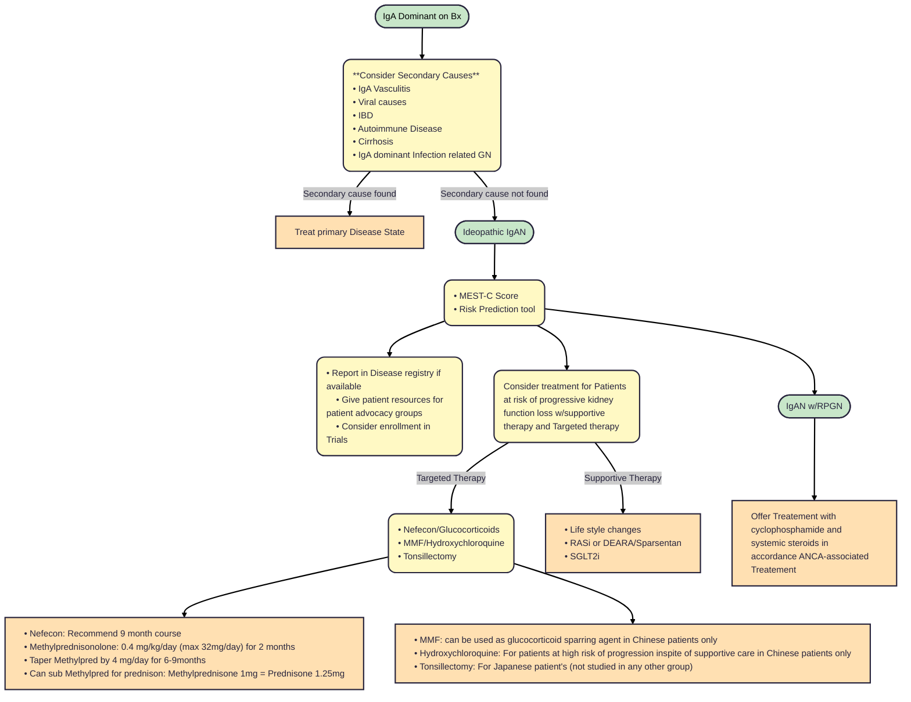

# **Immunoglobulin A Nephropathy (IgAN)/Immunoglobulin A Vasculitis (IgAV)**
## **Overview**
 * IgAN
      1. Glomerular Disease w/co-dominant IgA Glomerular staining
      2. Three types: Primary, Secondary, and Systemic forms (IgA Vasculitis)
      3. Most commen pattern of primary glomerular disease world wide
      4. Most prevalent in people of East Asian ancestry followed by Caucasians
      5. IgA deposistion can be found in MCD: if IgA found o kidney biopsy but otherwise consistent w/MCD, patient should be treated with therapy directed towards MCD
      6. Mest-C Score: Risk tool/score provide earlier risk predicition in IgAN
         - M --> Mesangial hypercellularity
         - E --> Endocapillary hypercellularity
         - S --> Segmental Sclerosis
         - T --> Interstitial fibrosis/Tubular atrophy
         - C --> Crescents 
 * IgA Vasculitis
      1. IgA autoantibodies deposition in the vessels
      2. Children < 16 years of age, often self limitting
      3. Glomerular disease 30% children, 60% Adults
      4. Worse GN in children, worse outcomes in Adults
      5. Adults typicaly more severe and relapsing disease
## **Pathophysiology**
 * IgAN
      1. GN with co-dominant IgA glomerular staining with IgA deposistion in the Mesangial +/- Capillary
      2. IgG typically also presented along with C3
      3. 4 HIT Model
         - Production of poorly glycosylated IgA1 (Gd-Ig-A1)
         - Production Anti-Gd-IgA1 autoantibodies (anti-Gd-IgA1 autoantibodies)
         - Formation of Glomerular deposition of Immuncomplexes
         - Deposition of circulating immunce complexes --> Mesangial, Podocyte, Endothelial inducingc cytokine release, compliment activation, and inflammation causing injury
    4. Acute Lesion
         - Mesangial Hypercellularity
         - Endocapillary Hypercellularity
         - Crescent
         - FSGS and podocytopathy
     5. Chronic lesions: corelate with outcome
        - IFTA
        - FSGS
        - Global Sclerosis
        - Arteriosclerosis
 * Mest-C
      1. T score: Most Consistent predictor of Renal Survival
      2. M1, S1, T1/2: Worse outcomes, Regardless of Immunosupression status
      3. E1 and C1: Poor out comes in patient not treated w/Immunosupression
      4. C2: Predicitive of poor outcomes regardless of Immunosupression (not synonymous w/RPGN)
      5. S1 w/podocytopathy: heavier proteinuria and Rapid eGFR loss --> Better response to steroids 
 * IgAV
      1. Systemic vasculities IgA1-dominant deposits
      2. IgA autoantibodies desposition in the small vessels affecting: skin, joints, intestines, and kidney (rarely affects lungs and CNS)
## **Clinical Presentation**
 * Hematuria
 * Proteinuria: Rarely > 3.5g/d
 * Edema
 * HTN
## **Diseases Associated with IgAN/IgAV**
  * Diseases
    1. Cirrhosis
    2. Portal HTN
    3. Inflammatory Bowel Disease
    4. Celiac
    5. Dermatits Herpetiformis
    6. Psoriasis
  * Infections
    1. HIV
    2. Hepatitis 
    3. TB
    4. Brucellosis
    5. Lerosy 
## **Treatment**

## **Sources**
 * [Proteinuria Trajectory and Disease Progression in Children and Adults w/IgA Nephropathy/Vasculitis](https://renal.videomed.live/videos/069bdab11e1ce0c48c/2025-07-17-10-20-pathology-of-ig-a-nephropathy-and-ig-a-vasculitis-m-barry-stokes-md)
 * [Indications for Corticosteroids in IgA Nephropathy](https://pubmed.ncbi.nlm.nih.gov/35108391/)
 * [Oxford Classification of IgA Nephropathy](https://pubmed.ncbi.nlm.nih.gov/19571790/)
 * [Uptodate IgA nephropathology](https://www-uptodate-com.ezproxy.ttuhsc.edu/contents/iga-nephropathy-pathogenesis?search=drug%20associated%20iga%20nephropathy&source=search_result&selectedTitle=5~103&usage_type=default&display_rank=5)
---
*Last updated: 9/2025 by Ashley Kinder, D.O.*
*Next review: 9/2026*
