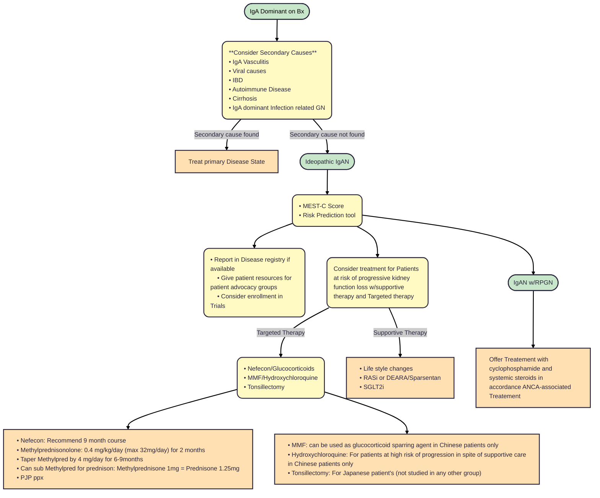

# **Immunoglobulin A Nephropathy (IgAN)/Immunoglobulin A Vasculitis (IgAV)**
## **Overview**
### IgAN (primary and secondary)
  * Glomerular disease w/co-dominant IgA glomerular staining
  * Most common pattern of primary glomerular disease world wide
  * Most prevalent in people of East Asian ancestry followed by Caucasians
  * Slowly progressive w/25-30% of patients developing kidney failure w/in 20-25years
  * Two predicition tools: International IgAN prediction tool and the MEST-C score
  * Variant forms of IgAN
    1. IgAN with RPGN
        * greater than 50% decline in eGFR over three months or less plus the presence of crescents on kidney biopsy
        * Greater than 30% crescents may be a marker for risk of rapid progression
        * biopsy typicall demonstrates mesangial and endocapillary hypercellularity and a high proportion of glomeruli affected by crescents
        * Generally poor coutcomes
    2. IgAN with apparent minimal change disease
        * IgA depositions can be found in MCD
        * These patients typically benefit with therapy directedtowards MCD (steroids alone)
        * Mesangial IgA deposits often disappear or are greatly reduced over time
        * typically have acute nephrotic syndrome with little to no hematuria, preserved kidney function and minimal glomerular on light microscopy, and diffuse fusion of the foot process of glomerular epithelial cells on electron microscopy 
    3. IgAN with AKI
        * AKI can occure during episodes of gross hematuria --> tubular obstruction by red cell cast or acute tubulare necrosis from iron relased from lysed red cells
        * typically the kidney biopsy reveals mesangial proliferation and segmental crescents in small amount of glomeruli (less than 25%) which are insufficient to account fo the AKI
### IgA Vasculitis (Henoch-Schonlein purpura) (systemic for of IgAN)
  * IgA autoantibodies deposition in the vessels
  * Children < 16 years of age, often self-limitting
  * Glomerular disease 30% children, 60% adults
  * Worse GN in children, worse outcomes in adults
  * Adults typicaly more severe and relapsing disease
## **Pathophysiology**
### IgAN
  * GN with co-dominant IgA glomerular staining with IgA deposistion in the mesangial +/- capillary
  * IgG typically also presented along with C3
  * EM reveals typicall electone dense deposits, primarly in the mesangium
    1. Subendothelial deposits can be present, typically in more active disease
    2. Subepithelial deposits are rare and should raise the posibility of igA-dominant IRGN
  * 4 HIT Model
    1. Production of poorly glycosylated IgA1 (Gd-Ig-A1)
        - likely produced by mucoally primed B-lymphocytes (mucol microbiome likely plays a role inmodulating gd-1Ga1 production)
    3. Production Anti-Gd-IgA1 autoantibodies (anti-Gd-IgA1 autoantibodies)
    4. Formation of glomerular deposition of immuncomplexes
    5. Deposition of circulating immune complexes --> mesangial, podocyte, endothelial inducing cytokine release, compliment activation, and inflammation causing injury
  * Acute lesion
    1. Mesangial hypercellularity
         - Endocapillary hypercellularity
         - Crescent
         - FSGS and podocytopathy
     2. Chronic lesions: correlate with outcome
        - IFTA
        - FSGS
        - Global sclerosis
        - Arteriosclerosis
 * Mest-C: Risk tool/score provide earlier risk prediction in IgAN
      1. T score: Most consistent predictor of renal survival
      2. E: Independently associated with increased proteinuria at the time of kidney biopsy
      3. S: Independently associated with a longitudinal increase in proteinuria and decrease in eGFR
      4. M1, S1, T1/2: Worse outcomes, regardless of immunosupression status
      5. E1 and C1: Poor outcomes in patients not treated with immunosupression
      6. C2: Predicitive of poor outcomes regardless of immunosupression (not synonymous w/RPGN)
      7. C1 and C2: strongly associated with complement activation
      8. S1 w/podocytopathy: heavier proteinuria and rapid eGFR loss --> better response to steroids

|Histology|MEST-C|
|---------|------|
|Mesangial hypercellularity| MO: < 50% glomeruli; M1: > 50% glomeruli|
|Endocapillary hypercellularity| E0: absent; E1: present|
|Segmental Sclerosis|S0: absent; S1: present|
|Interstitial fibrosis/tubular atrophty|T0: 0-25%; T1: 25-50%; T2: >50%|
|Crescents| C0: abscent; C1 1-25%; C2 >25%|

  * [International IgAN predition tool: designed to predict the risk of a 50% decline in eGFR or ESRD after biopsy](https://qxmd.com/calculate/calculator_499/international-igan-prediction-tool-at-biopsy-adults)

### IgAV
  * Systemic vasculities IgA1-dominant deposits
  * IgA autoantibodies desposition in the small vessels affecting: skin, joints, intestines, and kidney (rarely affects lungs and CNS)
## **Clinical Presentation**
 * Hematuria
 * Proteinuria: rarely >3.5g/d
 * Edema
 * HTN
 * Rash
 * Arthraligia
 * Abdominal pain
## **Diseases Associated with IgAN/IgAV**
  * Diseases
    1. Cirrhosis
    2. Portal HTN
    3. Inflammatory bowel disease
    4. Celiac
    5. Dermatits herpetiformis
    6. Psoriasis
  * Infections
    1. HIV
    2. Hepatitis 
    3. TB
    4. Brucellosis
    5. Leprosy 
## **Treatment**
### IgAN

```mermaid
---
config:
  theme: redux
---
flowchart TD
    A(["IgA Dominant on Bx"]) --> n1["**Consider Secondary Causes**
    • IgA Vasculitis
    • Viral causes
    • IBD
    • Autoimmune Disease
    • Cirrhosis 
    • IgA dominant Infection related GN"]
    n1 -- Secondary cause found --> n2["Treat primary Disease State"]
    n1 -- Secondary cause not found --> n3(["Ideopathic IgAN"])
    n3 --> n4["• MEST-C Score
    • Risk Prediction tool"]
    n4 --> n5["• Report in Disease registry if available
    • Give patient resources for patient advocacy groups
    • Consider enrollment in Trials"] & n6["Consider treatment for Patients at risk of progressive kidney function loss w/supportive therapy and Targeted therapy"] & n9(["IgAN w/RPGN"])
    n6 -- Targeted Therapy --> n7["• Nefecon/Glucocorticoids
    • MMF/Hydroxychloroquine
    • Tonsillectomy"]
    n6 -- Supportive Therapy --> n8["• Life style changes
    • RASi or DEARA/Sparsentan
    • SGLT2i"]
    n9 --> n10["Offer Treatement with cyclophosphamide and systemic steroids in accordance ANCA-associated Treatement"]
    n7 --> n11["• Nefecon: Recommend 9 month course
    • Methylprednisonolone: 0.4 mg/kg/day (max 32mg/day) for 2 months
 • Taper Methylpred by 4 mg/day for 6-9months
• Can sub Methylpred for prednison: Methylprednisone 1mg = Prednisone 1.25mg
• PJP ppx"] & n12@{ label: "• MMF: can be used as glucocorticoid sparring agent in Chinese patients only\n    • Hydroxychloroquine: For patients at high risk of progression in spite of supportive care
in Chinese patients only\n   • Tonsillectomy: For Japanese patient's (not studied in any other group)" }
    n1@{ shape: rounded}
    n4@{ shape: rounded}
    n5@{ shape: rounded}
    n6@{ shape: rounded}
    n7@{ shape: rounded}
    n8@{ shape: rect}
    n12@{ shape: rect}
    style A fill:#C8E6C9,color:#000000
    style n1 fill:#FFF9C4,text-align:left,white-space:nowrap
    style n2 fill:#FFE0B2,text-align:left
    style n3 fill:#C8E6C9,text-align:left
    style n4 fill:#FFF9C4,text-align:left
    style n5 fill:#FFF9C4,text-align:left
    style n6 fill:#FFF9C4,text-align:left
    style n9 fill:#C8E6C9,text-align:left
    style n7 fill:#FFF9C4,text-align:left,white-space:nowrap
    style n8 fill:#FFE0B2,text-align:left,white-space:nowrap
    style n10 fill:#FFE0B2,text-align:left
    style n11 fill:#FFE0B2,text-align:left,white-space:nowrap
    style n12 fill:#FFE0B2,text-align:left,white-space:nowrap
```

  * [IgAN prediction tool at biopsy - Adult](https://qxmd.com/calculate/calculator_499/international-igan-prediction-tool-at-biopsy-adults)
  * [IgAN prediction tool post-biopsy - Adult](https://qxmd.com/calculate/calculator_839/international-igan-prediction-tool-post-biopsy-adults)
### Medications approved recently by FDA for IgAN
  * Nefecon (TRF-Budesonide, 2021)
    1. 16mg daily for 9 months then reduce to 8mg dialy for 2 weeks before session 
  * Sparsentan (2023)
    1. Should avoid use with ACEi/ARB due class DEARA
    2. Patients must be vaccinated against encapsulated bacteria at least 2 weeks prior to first dose
    3. Do not start during active infections
    4. REMS: Requires monthly liver testing for first 12 months, then every 3 months thereafter
    5. 200mg BID, duration uncertain
  * Iptocopan (2024)
  * Atrasentan (2025)
    1. Endothelial antagonist only and can be used with ACEi/ARB
    2. No REMS
    3. 0.75mg daily, life long treatemtn
### New therapies currently being studied 
  * Target: APRIL
    1. Sibeprenlimab (Trial: VISIONARY)
    2. Zigakibart (Trial: BEYOND)
  * Target: APRIL/BAFF
    1. Telitacicept (Trial: NCT05799287)
    2. Povetacicept (Trial: APPLAUSE-IgAN)
  * Target: Alternative pathway, factor B
    1. Sefaxersen (Trial: IMAGINATION)
  * Target: Terminal point in Complement pathway, C5
    1. Ravulizumab (Trial: I CAN)
### IgAV
  * No proven therapy at this time
  * Age appropiate malignancy screening
  * Consider glucocorticoid therapy
  * Supportive therapy: RASi, life style changes (diet, exercise, < 2g salt per day), SGLT2i
  * Recommend enrolling in clinical trials
  * RPGN: Offer treatement with cyclophosphamide and systemic steroids in accordance ANCA-associated Treatement
## **Sources**
 * [KDIGO Guidlines IgAN 2025](https://kdigo.org/wp-content/uploads/2024/08/KDIGO-2025-IgAN-IgAV-Guideline.pdf)
 * [Proteinuria Trajectory and Disease Progression in Children and Adults w/IgA Nephropathy/Vasculitis](https://renal.videomed.live/videos/069bdab11e1ce0c48c/2025-07-17-10-20-pathology-of-ig-a-nephropathy-and-ig-a-vasculitis-m-barry-stokes-md)
 * [Indications for Corticosteroids in IgA Nephropathy](https://pubmed.ncbi.nlm.nih.gov/35108391/)
 * [Oxford Classification of IgA Nephropathy](https://pubmed.ncbi.nlm.nih.gov/19571790/)
 * [Uptodate IgA nephropathology](https://www-uptodate-com.ezproxy.ttuhsc.edu/contents/iga-nephropathy-pathogenesis?search=drug%20associated%20iga%20nephropathy&source=search_result&selectedTitle=5~103&usage_type=default&display_rank=5)
 * [Atrasentan in patients w/IgAN; ALIGN](https://www.nejm.org/doi/full/10.1056/NEJMoa2409415)
 * [Iptacopan in IgAN; APPLAUSE](https://www.nejm.org/doi/full/10.1056/NEJMoa2410316)
 * [Sibeprenlimab in IgAN; ENVISION](https://pubmed.ncbi.nlm.nih.gov/37916620/)
 * [Sparsentan in IgAN; PROTECT](https://pubmed.ncbi.nlm.nih.gov/37931634/)
 * [NEFECON in IgA; NEfIGArd](https://pubmed.ncbi.nlm.nih.gov/39724565/)
 * [Efficacy and safety of Nefecon](https://www.sciencedirect.com/science/article/abs/pii/S0140673623015544)
 * [Steroids in IgA; TESTING](https://pubmed.ncbi.nlm.nih.gov/34731857/)
 * [Intensive supportive care plus immunosuprerssion in IgAN; STOP-IgAN](https://www.nejm.org/doi/full/10.1056/NEJMoa1415463)
 * [Henoch-Schonlein purpura in adults](https://www.scopus.com/pages/publications/0036232277)
 * [Sparsentanin patietn with IgA, interim analysis](https://www.sciencedirect.com/science/article/abs/pii/S014067362300569X)
 * [Targeting Endothelin A receptor in IgAN](https://www.sciencedirect.com/science/article/pii/S246802492301402X)
 * [Empagliflozin in CKD](https://scholar.google.com/scholar_lookup?title=Empagliflozin%20in%20patients%20with%20chronic%20kidney%20disease&author=The%20EMPA-KIDNEY%20Collaborative%20Group&publication_year=2023&pages=117-127)
 * [ACEi in children and young people w/IgAN](https://www.scopus.com/pages/publications/34249897747)
 * [Risk-Predicition tool evaluation](https://jamanetwork.com/journals/jamainternalmedicine/fullarticle/2730331)
 * [MMF in IgA](https://www.sciencedirect.com/science/article/pii/S008525381549917X)
 * [MMF w/prednisone in IgA](https://www.sciencedirect.com/science/article/abs/pii/S0272638617300082)
 * [Prednisone and ACEi vs ACE alone in IgAN](https://www.sciencedirect.com/science/article/abs/pii/S0272638608012304)
 * [10 year follow up in IgA supportive care vs supportive care and immunosupression](https://www.sciencedirect.com/science/article/pii/S0085253820305494)
 * [Methylprednisolone on decline in kidney function or failure in IgAN](https://jamanetwork.com/journals/jama/fullarticle/2792252)
 * [Key pathogenic biomarkers in IgAN with Nefecon](https://www.sciencedirect.com/science/article/pii/S0085253823007780)
 * [Uptodate IgAN](https://www-uptodate-com.ezproxy.ttuhsc.edu/contents/iga-nephropathy-treatment-and-prognosis?search=IgA%20nephropathy%20treat%2Cemt%20amd%20%5Brpgmpsos&source=search_result&selectedTitle=3~150&usage_type=default&display_rank=3&searchCorrelationId=2edb7a54-fc2a-416d-9864-e643b2324a1e&searchCorrelationTerm=IgA%20nephropathy%20treat%2Cemt%20amd%20%5Brpgmpsos#H349069588)
---
*Last updated: 9/2025 by Ashley Kinder, D.O.*
*Next review: 9/2026*
