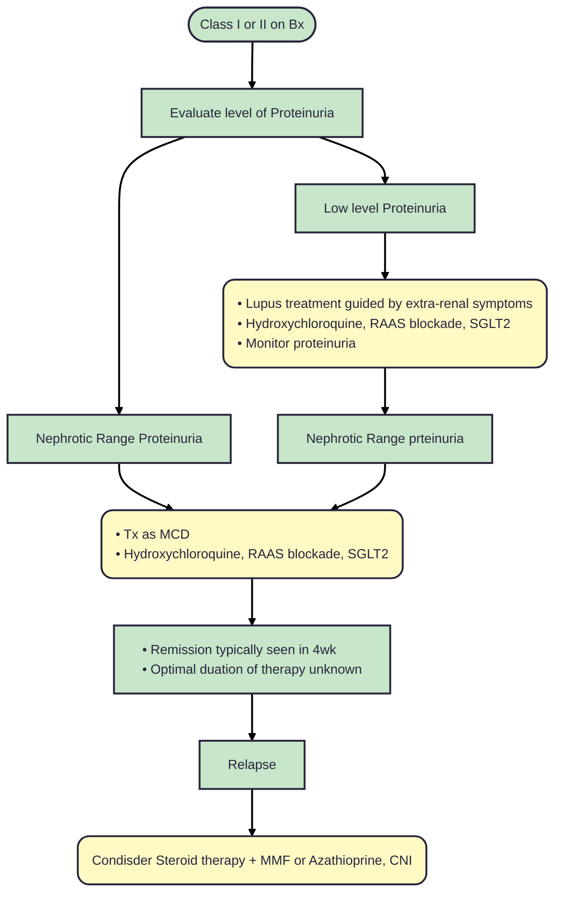
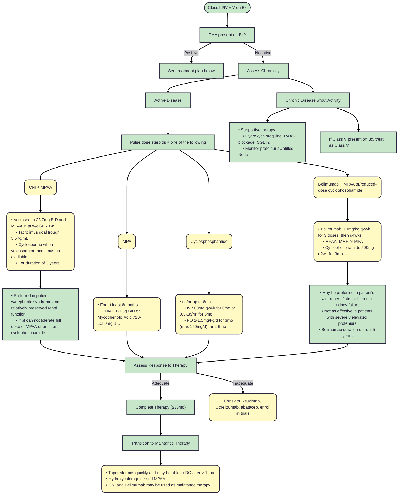
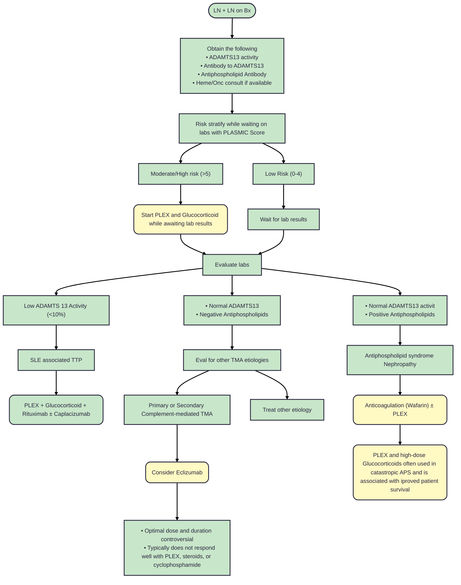

# **Lupus Nephritis (LN)**
## **Overview**
  * 6 Classes
      1. Minimal Mesangial LN
      2. Mesangial Proliferative LN
      3. Focal LN (< 50% of glomeruli)
      4. Diffuse LN (≥ 50% of glomeruli)
      5. Membranouse Lupus
      6. Advanced Sclerosing LN (≥ 90% global sclerosed glomeruli)
  * Can have mixed classes of LN
  * LN rare disease (20-60% of SLE cases)
  * Females > Males (90% of LN is females)
  * LN typically occurs more often in Black, Asian, and Hispanic Ethnicities
  * Up to 30% of LN patients progres to kidney failure w/in 15 years of diagnosis
  * Patient's SLE are at higher risk of cardiovascular events and mortality when diagnosised with LN
  * Early decrease i nprotenuria predicts improved kidney function outcomes
  * Childhood onset of SLE is a ssociated wtih increased risk of LN and more severe disease
## **Pathophysiology**
  * Pathogenesis
    1. Abnormal B lymphocyte hyperactivity --> mounting an immune response to dying cells
          - Any environment where there is delayed clearance of dying cells (e,g. infections, hormonal responces, drughs) along with genetic mutations that may account for predisposition to hyperactive immune responce may be associated with SLE
    3. Immunity
         - Inate: interferon regulation and production, Nucleic acid sensitivity, Increased TLR (toll-like receptors) signaling (activate immune responce and increase cell recruitment)
         - Adaptive: HLA-DR2, HLA-DR3, Bcell and Tcell activation and signialing
         - Immune Complex: Iincreased phagocytosis, cell adhesion, and compliment activation forming immunce complexes
         - Insitue Immune complex formation or pre-formed immune complex formation causing injury
  * Classes
    1. Class I and II: gnerally normal kidney function. May have low grade protienuria
    2. Class III
         - Active or inactive focal, segmental and/or global endocapillary and/or extracapillary GN involving < 50% glomeruli
         - Typically w/focal subendothelial deposites w/or w/out mesangial alteration
    4. Class IV
         - Active or inactive focal, segmental and/or global endocapillary and/or extracapillary GN involving ≥ 50% glomeruli
         - Typically w/focal subendothelial deposites w/or w/out mesangial alteration
    6. Class V
         - Global or segmental subepithelial immune deposites or their morphologic sequela w/or w/out mesangial alteration
         - May have advanced sclerosis
         - Can be added to class III or IV when subepithelial deposites involve at least 50% of glomerular capillary surface area in at least 50% of glomeruli
         - Patients with immunofluorescent staining positive for Ext 1/2 typically have overall better response to treatment
    8. Class VI
         - 90% or more of global sclerosed glomeruli
         - Classification classification for advanced disease, not likely to benefit from increased immune supression
  * TMA
    1. Causes most revelant to LN: TTP, Antiphospholipid, and compliment medicated diesease
    2. can occure due to shiga-toxin-HUS, Infections, drugs, or malignancies
## **Clinical Presentation**
  * Range of symptoms of SLE (including but not limited to) 
      - fatigue, fever, weight loss, Arthritis/arthralgia, butterfly rash, photosensitivity, alpecia, raynaud, pleurisy, pericarditis, lymphadenopathy, psychosis, etc.
      - LN symptoms: edema, hypoalbuminemia, proteinuria, hyperlipidemia, frothy urine, hematuria
  * Patient's with lupus should be screen yearly for proteinura: progeinuria of 500mg/dL or great should prompt further infestigation  
  * Labs:
      - Auto-ab: Anti-dsDNA, Anti-Smith, Anti-U1 ribonucleoprotein, anti-ro/SSA and anti-La/SSB, Anti-histone, anti-phospholipid
      - General: CBC, CMP, CK, UA, SPEP, ANA, ESR/CRP, Compolement levels
  * Drug induced lupus: anti-dsDNA or Anti-smith positive very rare, Anti-histone very commenly positive
  * In EULAR (European Alliance of Association for Rheumatology)/ACR (American College of Rheumatology) Criteria for diagnosis of lupus, Renal biopsy demonstrating class III or IV is susificiant on it's own to diagnosis SLE with no other clinical or immunologic criteria required. 
## **Drugs and Diseases Associated with Lupus**
  * Kidney disease in drug-induced lupus is rare
  * Some drugs commenly associated with drug-induced lupus are as follows: 
    - Minocycline
    - Hydralazine
    - Isoniazid
    - Procainamide
    - TNF therapies
## **Deffinitions of Treatment Response**
|Criteria|Definition|
|--------|----------|
|Complete Response| • Reduction in proteinuria < 0.5g/g measured as PCR from 24hr urine; • Stabilization or improvement in kidney function (± 10-15% of baseline);• W/in 6-12mo of starting therapy, but could take more than 12mo|
|Primary Efficacy Renal Response| • PCR ≤ 0.7 g/g; • eGFR that was no worse than 20% below the pre-flare value or ≥ 60mL/min per 1.73m²; • No use of rescue therapy for treatment failure|
|Partial response| • Reduction in progeinuria by at least 50% and < 3g/g measured as teh PCR from 24hr urine; • Stabilization or improvement in kidney function (± 10-15% of baseline); • W/in 6-12mo of starting therapy|
|No Kidney response| Failure to achieve a partial or complete response w/in 6-12mo of starting therapy|

  * Goals of tx
      - 25% reduction of protienuria at 3mo
      - 50% reduction of protienuria at 6mo
      - UPCR below 0.5-0.7mg/mg at 12mo

## **Treatment**
### All Lupus Nephritis patients
  * Hydroxychloroquine: 200-400mg as a single daily dose or divided into two doses
  * Anti-Proteinuria: RASS blockade (ACE/ARB) and SGLT2i
  * Life style changes: smoking cessation, exercise, body weight management, ect.
### Class I and II LN

### Class III and IV ± V

### TMA and LN

### Class V
## **Sources**
  * [KDIGO 2024 Lupus Guidelines](https://www.kidney-international.org/action/showPdf?pii=S0085-2538%2823%2900627-0)
  * [Risk of CV events and mortality in LN](https://pubmed.ncbi.nlm.nih.gov/28053276/)
  * [UPToDate Drug induced lupus](https://www-uptodate-com.ezproxy.ttuhsc.edu/contents/drug-induced-lupus?search=drug%20indued%20lupus&source=search_result&selectedTitle=4~150&usage_type=default&display_rank=4#H16)
  * [UpToDate diagnosis of SLE](https://www-uptodate-com.ezproxy.ttuhsc.edu/contents/systemic-lupus-erythematosus-in-adults-clinical-manifestations-and-diagnosis?search=symptoms%20of%20lupus&source=search_result&selectedTitle=1~150&usage_type=default&display_rank=1#H914180)
---
*Last updated: 12/2025 by Ashley Kinder, D.O.*
*Next review: 12/2026*
