# **Minimal Change Disease (MCD)** 
## **OverView**
 * Previously known as lipiod Nephrosis, nil disease, and minimal change nephropathy
 * Podocytopathy most commenly seen in children; seen with 10-25% of Adults with Nephrotic syndrome
 * Steroid responsiveness demonstrates good long term prognosis
 * Adults typically have slower response than children
 * Relapses infrequent after remission, Up to 33% of patients will be frequent relapsers (11-29%), or steroid dependent (14-30%) 
## **Pathophysiology** 
 * Pathogensis currently unclear; however, it is thought that T-cell dysregululation may play a part in podocyte injury. Improvement with B cell-depleting medications support a role for B cells as well
 * Pathology: Podocyte foot process effacement on LM and EM
 * In adults MCD may be superimposed on pre-existing chronic lesions
 * Antibiodies to Nephrine may be associated with podocyte injury in MCD and FSGS, though still under study at this time
## **Clinical Presentation**
 * Nephrotic range proteinuria --> typically large amount of protein in urine, in the range of 10g/g
 * Signs of Volume overload. (e.g lower extremty edema, peri-orbital edema, ect.)
 * Hypoalbuminemia
 * Hypercholesterolemia
 * AKI on presentation frequently
## **Definitions of Treatment Response**
 * Complete remission
    1. Reduction of proteinuria to <0.3g/d or PCR <300mg/g, stable serum creatine and serum albumin >3.5g/dl
 * Partial Remission
    1. Reduction of proteinuria to <0.3-3.5g/d or PCR <300-3500mg/g, and a decrease >50% from baseline
 * Relapse
    1. Proteinuria >3.5/d or PCR >3500mg/g after complete remission has been achieved
 * Steroid-resistant
    1. Reduction of proteinuria to >3.5/d or PCR >3500mg/g, with <50% from baseline despite prednisone 1mg/kg/day or 2mg/kg every other day for >16weeks
 * Frequent Reelapsing
    1. Two or more relapses per 6 months (or four or more relapses per 12months)
 * Steroid-dependent
    1. Relapsing occuring during, or w/in two weeks of completing glucocorticoid therapy
## **Treatment**

```mermaid
flowchart TB
    A(["MCD"]) --> B(["Steroid"]) & n1(["Steroid Sparing"])
    B --> C["Prednisone 1mg/kg PO Daily (Max 80mg daiy)
    or
    Prednisolone 2mg/kg PO EOD
    (Max dose 120 EOD)
    for 4-16wks"]
    C --> n2(["Remission achieved"]) & n8(["Frequent Relapse/Steroid Dependent"])
    n2 --> n3["Begin taper after 2wks of complete remission and taper over 24 weeks"]
    n3 --> n4(["Relapse"])
    n4 --> n5["Prednisone 1mg/kg PO Daily
    (Max dose 80mg Daily)
    for 4 wks or until remission"]
    n5 --> n6["Wean by 5mg q3-5 days to Discontinue  w/in 1-2months"]
    n1 --> n7["-> Cyclophoshamide 2-2.5mg/kg PO Daily for 8 weeks
    -> Cyclosporin 3-5mg/kg PO Daily in divided doses for 1-2 years
    -> Tacrolimus 0.05-0.1mg/kg Daily in divided doses for 1-2 years +/- reduce dose steroids (prednisone 1mg/kg, 60mg daily max)
    -> Myfortic 720mg PO BID or/ CellCept 1000mg PO BID + prednisone 0.5mg/kg Daily (max 40mg Dail) (Graduallly taper over a year)"]
    n7 --> n8
    n6 --> n8
    n8 --> n9(["No hx of Cyclophosphamide use"]) & n10(["History of Cyclophosphamide use
    or
    Patient wish to avoid Cyclophosphamide exposure"])
    n9 --> n11["Cyclophosphamide 2-2.5mg/kg Po Daily for 8-12wk
    (Adjust dose for WBC)
    (12 wk may be associated w/less relapse in steroid dependent patients)"]
    n10 --> n12["**CNI**
    -> Cyclosporine 3-5mg/k PO Daily in didvided doses for 1-2 years; goal trough 150-200ng/ml (125-166nmol/L)
    -> Tacrolimuse 0.05-0.1mg/kg PO Daily in divided doses for 1-2 years; goal trough 4-7ng/mL (5-8.7nmol/L)
    -> Can use CNI +/- steroids; if giving steroids reduce CNI dose
    -> If CNI depended use lowest dose possible and switch therapy if CNI toxicity occurs
    **Rituximab**
    -> 375mg/m2 qweekly for 4 doses
    -> 375mg/m2 for one dose; Repeat after one wk if CD19 >5/mm3
    -> 1g x 2 doses; 2 wks apart
    -> Relapse after induction doses can give 375mg/m2 for one dose or give 1g for one dose
    **Myfortic** 720mg PO BID or/ **CellCept** 1000mg PO BID + prednisone 0.5mg/kg Daily (max 40mg Dail)"]
    C@{ shape: rounded}
    n3@{ shape: rounded}
    n5@{ shape: rounded}
    n6@{ shape: rounded}
    n7@{ shape: rounded}
    n11@{ shape: rounded}
    n12@{ shape: rounded}
    style A fill:#BBDEFB
    style B fill:#BBDEFB
    style n1 fill:#BBDEFB
    style C fill:#FFCDD2,color:#000000
    style n2 fill:#BBDEFB
    style n8 fill:#BBDEFB
    style n3 fill:#FFCDD2
    style n4 fill:#BBDEFB
    style n5 fill:#FFCDD2
    style n6 fill:#FFCDD2
    style n7 color:#000000,fill:#FFCDD2
    style n9 fill:#BBDEFB,color:#000000
    style n10 fill:#BBDEFB
    style n11 fill:#FFCDD2
    style n12 fill:#FFCDD2,color:#000000
```

* Combotherapy a reasonable theraputic option
* Individualize treatment per patient 
* Optimal duration of steroid on Relapse unknown
## **Sources**
* [KDIGO GN Guidlines](https://kdigo.org/guidelines/gd/)
* [Rituximab treatment in adults with steroid-dependent minimal change disease](https://www.sciencedirect.com/science/article/pii/S0085253815557712)
* [Rituximab in Steroid-Sensitive Minimal Change Nephrotic Syndrome in Adults](https://karger.com/books/book/133/chapter-abstract/5070296/Rituximab-as-a-Therapeutic-Option-for-Steroid?redirectedFrom=fulltext)
* [Tacrolimus as a steroid-sparing agent for adults with steroid-dependent minimal change nephrotic syndrom](https://academic.oup.com/ndt/article-abstract/23/6/1919/1874422?redirectedFrom=fulltext)
* [Methylprednisolone pulses and low dose oral prednisone](https://www.bmj.com/content/291/6505/1305)
* [Rituximab as a front-line therapy for adult MCD](https://www.oncotarget.com/article/25612/text/)
* [Low Dose steroid and MMF in MCD](https://www.sciencedirect.com/science/article/pii/S0085253818305866)
* [Tacrolimus as theraputic option in MCD](https://academic.oup.com/ndt/article-abstract/23/6/1919/1874422?redirectedFrom=fulltext)
* [Cyclophosphamide in treatment of MCD](https://www.scopus.com/pages/publications/0018377671)
---
*Last updated: [Date] by [Physician Name]*
*Next review: [Date]*
