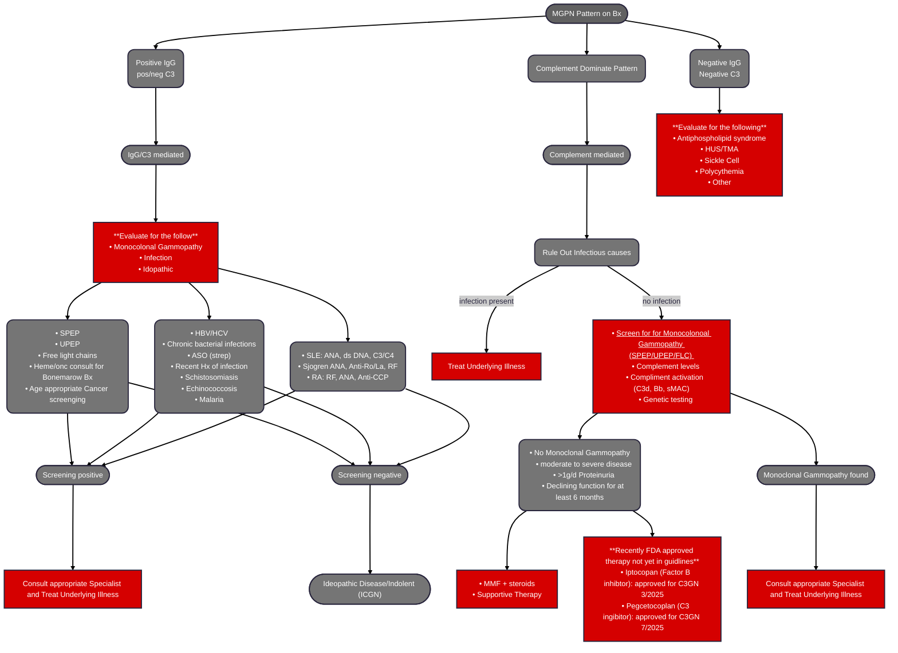
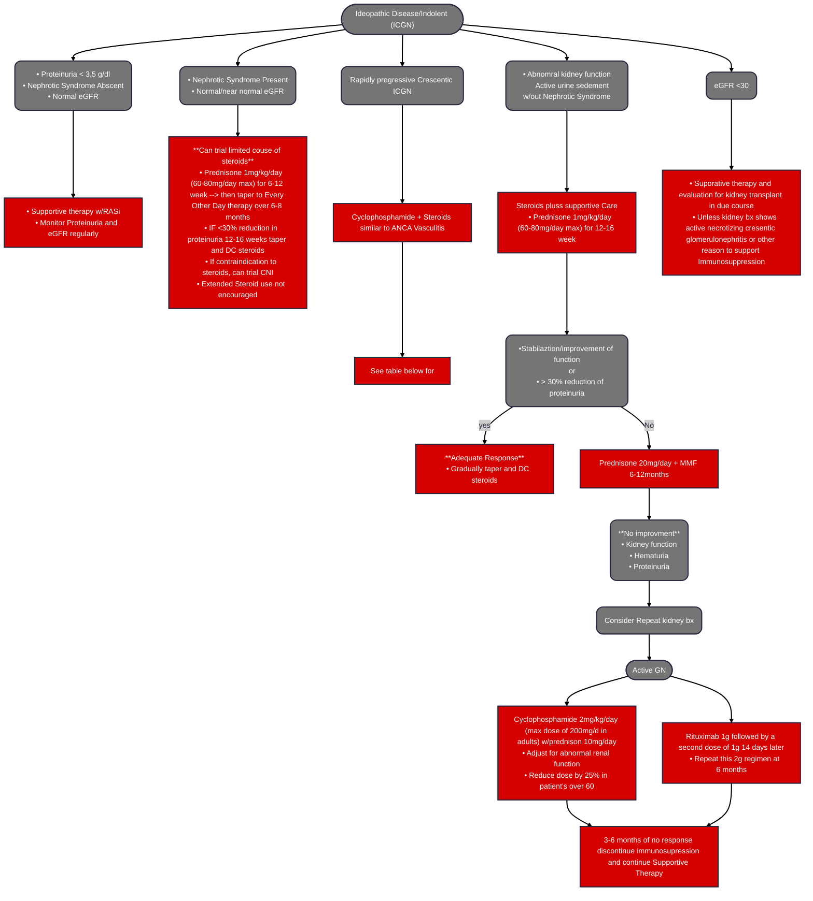

# **Membranoproliferative GN (MPGN)/C3GN**
## **Overview**
  * MPGN
    1. Is a descripter of a pattern of injury that can be associated with different disease states
    2. Implies that the pathogenic process has been occuring for some time and other patterns of injury may present as well (endocapillary proliferative, mesangioproliferative, and crescent GN)
    3. Historically had three classifications, but such nominclature/classification has fallen out of favor due to rise of immunflorscent staining increase in understanding of how the injury occurs
  * Cases of MPGN w/sole or dominant C3/C4 staining are classified as primary GN
  * C3 glomerulopathy is a rare entity that commenly presents in an MPGN pattern of injury and can be delinated in to two categories: C3 glmerulonephritis (C3GN) and Dense Deposition Disease (DDD)
    1. C3GN
        - Primarly found in adults
        - Older age associateed more w/Monocolonal gammopathy and has better out comes
        - Can be acquired or genetic
        - Commnonly induced by C3 nephritic factors
    2. DDD
        - Primarly children and adolescents of both genders
        - Typically very agressive disease with deterioration of renal function ending ESKD
    3. typically leads to ESKD
    4. Has high reoccurance in tranplant patients and is a cause of early graft failure
  * C4 glomerulopathy is more rare than C3, and has two catorgies similar to C3: C4GN and DDD
## **Pathophysiology**
  * MPGN
    1. Pathology:
        - Glomerular Capillary wall remodeling (double countr formation or "train track" appearance
        - Endocapillary proliferation/hypercellularity
        - Subendothelial deposits
        - Pathogenesis: Glomerular capillary injury from deposits mesangial or subendothelial found by EM
    3. Pathologic entities:
        - Immune Complex GN (ICGN)
            1. AB triggures reation of classic and lectin pathway (cancers, Infection, allergic auto-immune)
            2. Systemic Autoimmune disease
            3. Infection
            4. Fibrillary GN
        - Paraprotein-mediated GN
            1. PGNMID (proliferative glomerulonephritis w/monoconol immunoglobulin deposits
            2. Cryoglobulinemia 
        - Complement-mediated GN
            1. <ins>*Dysregulation of the Alternative pathway*</ins> (genetic or auto-antibioty or monocolonal)
            2. C3GN
            3. DDD
            4. Novel/Rare C4 glomerulopathy
        - Chronic TMA
            1. Membrane double contour, but no prliferation
            2. aHUS/HUS
            3. Drug associated
            4. APS (antiphospholipid syndrome)
  * C3
    1. <ins>*Dysregulation of the Alternative pathway*</ins> (genetic or auto-antibioty or monocolonal)
    2. C3 dominant/only staining of glomerular deposits
    3. Around 50% of cases have and MPGN pattern of injury
    4.  C3GN
        - mesangial or subendothelial deposts on EM
        - Mesangial Deposits: 99%
        - Capillary wall deposits: 97%
        - w/humps 49%
        - Post-infectious GN can mimic C3GN (hypocomplementemia and proteinuria tend to normalize and C4d staining is positive in post-infectious GN)
    5. DDD
        - Intramembrnous dense deposits: 100%
        - w/humps 25%
        - "saugage-like appearance" on EM due to dense depositio of the basement membrane
## **Clinical Presentation**
  * Hematuria
  * Worsening eGFR/rising serum Cr
  * Severe Proteinuria
  * C3GN: low serum C3 levels (50% of cases) and normal serum C4 levles
  * Chronic deterioration of renal function
  * HTN
## **Drugs and Disease Associated with MPGN/C3GN**
  * ICGN
    1. SLE
    2. RA
    3. Sjogren's
    4. Mixed connective tissues disease
    5. Drug induced
  * Infectous
    1. Bacterial: post strep
    2. Viral: HCV (including HCV -mixed cryogloblinemia), HBV
    3. Paracytic: Malaria, schistosomiosis, mycoplasma, leighmaniasis, filariasis, histoplasmosis
  * Fibrillary GN
    1. Polyconol subendotheial deposits 
## **Treatment**
### MPGN on Biopsy

### ICGN

### Cyclophosphamide Dosing

|Oral Cyclophosphamide|IV Cyclophosphamide|
|---------------------|-------------------|
|• 2mg/kg/day for 3months|• 15mg/kg at weeks: 0, 2, 4, 7, 10, 13 (16, 19, 21, 24 if required)|
|<ins>Reduction for Age and function</ins>|<ins>Reduction for Age and function</ins>|
| • 60 y/o: 1.5mg/kg/day|• 60 y/o: 12.5mg/kg/day|
| • 70 y/o: 1mg/kg/day| • 70 y/o: 10mg/kg/day|
| • Reduce by 0.5mg/kg/day for eGFR < 30| • Reduce by 2.5mg/kg for eGFR < 30|

### Prednisone Taper
|Week|Patient's <50kg|Patient's 50-70kg|Patient's >75kg|
|----|-----|-------|-----|
|1   |50mg |60mg   |75mg |
|2   |25mg |30mg   |40mg |
|3-4|20mg|25mg|30mg|
|5-6|15mg|20mg|25mg|
|7-8|12.5mg|15mg|20mg|
|9-10|10mg|12.5mg|15mg|
|11-12|7.5mg|10mg|12.5mg|
|13-14|5mg|7.5mg|10mg|
|15-16|5mg|5mg|7.5mg|
|17-18|5mg|5mg|7.5mg|
|19-20|5mg|5mg|5mg|
|21-22|5mg|5mg|5mg|
|23-52|5mg|5mg|5mg|
|>52|Investigator's local practice|Investigator's local practice|Investigator's local practice|

## **Sources**
 * [KDIGO GN Guidlines](https://kdigo.org/guidelines/gd/)
 * [C3 glomerulopathies general info](https://pmc.ncbi.nlm.nih.gov/articles/PMC10704907/)
 * [Developing Therapies for C3 Glomerulopathy](https://khi.asn-online.org/uploads/developing_therapies_for_c3_glomerulopathy__report.18.pdf)
 * [Efficacy and Safety of Iptacopan i nPatient w/C3 Glomerulopathy](https://www.sciencedirect.com/science/article/pii/S2468024924023222)
 * [Alternative Complement pathway inhibition w/iptacopan for treatment of C3G](https://pubmed.ncbi.nlm.nih.gov/36217526/)
 * [Phase 3 Trial of Pegcetacoplan fof Patient with C3G or IC-MPGN](https://journals.lww.com/jasn/pages/articleviewer.aspx?year=2024&issue=10001&article=00313&type=Fulltext)
 * [Safety and EFficacy of Pegcetacoplan](https://pmc.ncbi.nlm.nih.gov/articles/PMC10658235/)
 * [MMF in Combination w/Steroids for C3G Case series](https://pubmed.ncbi.nlm.nih.gov/29326307/)
 * [MMR in C3G and Pathogenic Drivers of the Disease](https://pubmed.ncbi.nlm.nih.gov/32816888/)
 * [C5 Convertase blockade in MPGN](https://www.sciencedirect.com/science/article/abs/pii/S0272638619301003)
 * [Safety and Efficacy of Avacopan in Patients w/C3G](https://pubmed.ncbi.nlm.nih.gov/39392695/)
