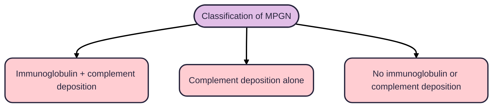
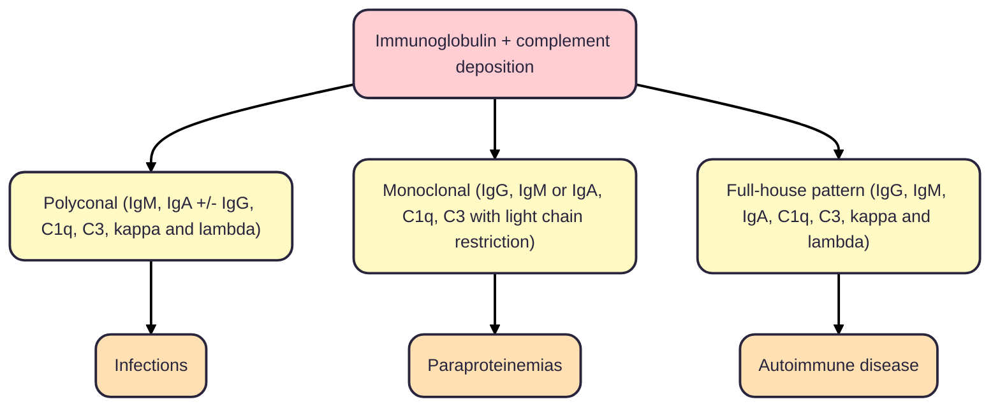
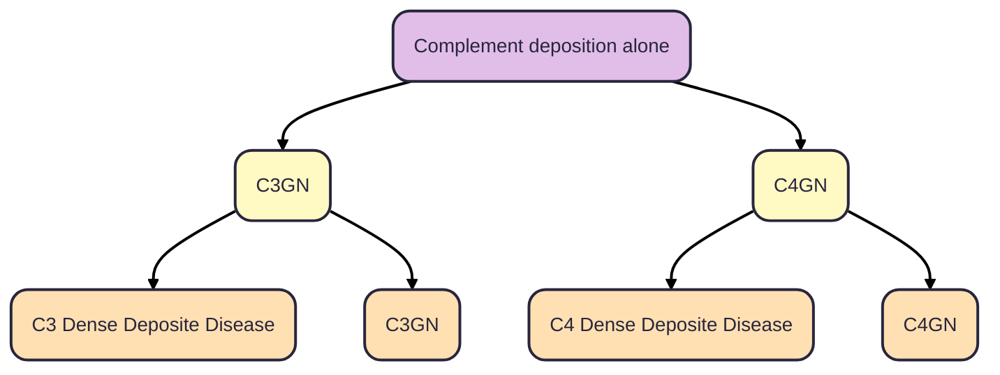
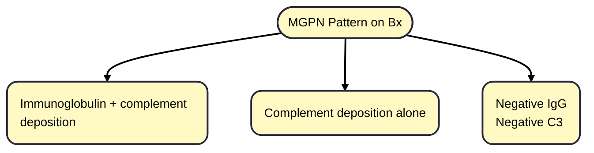
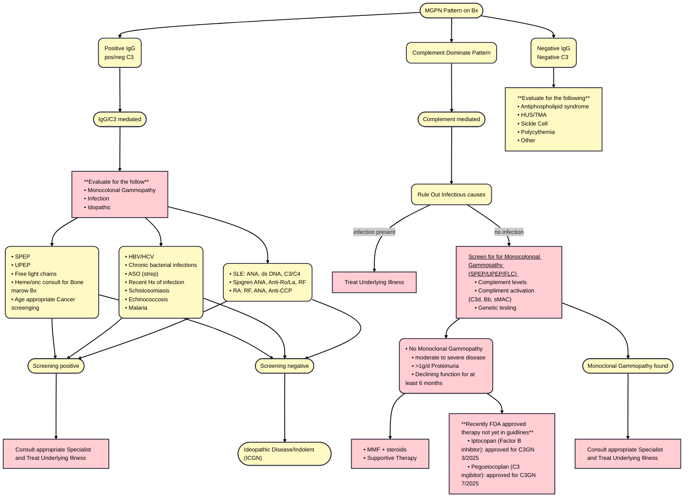
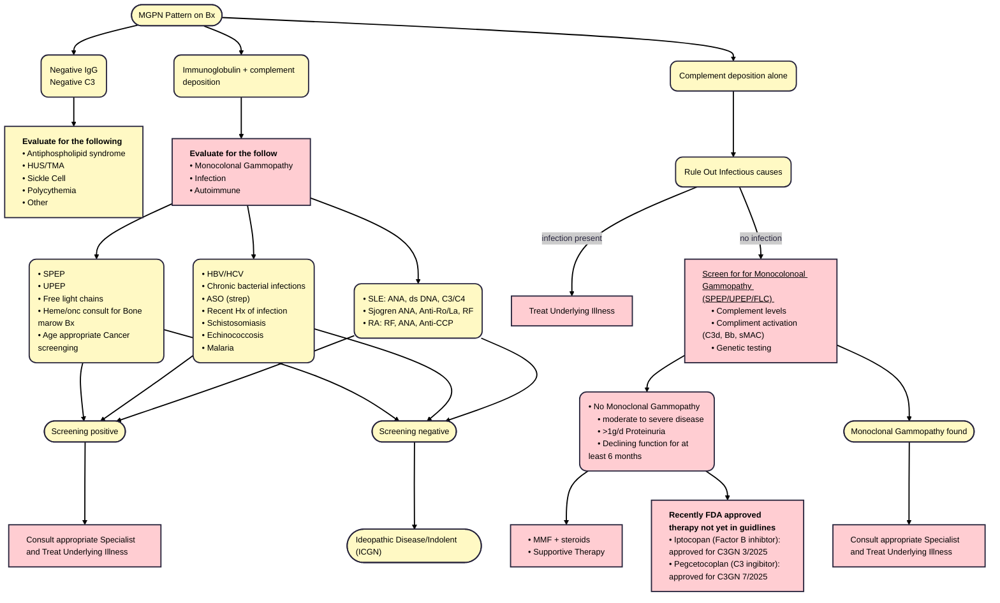
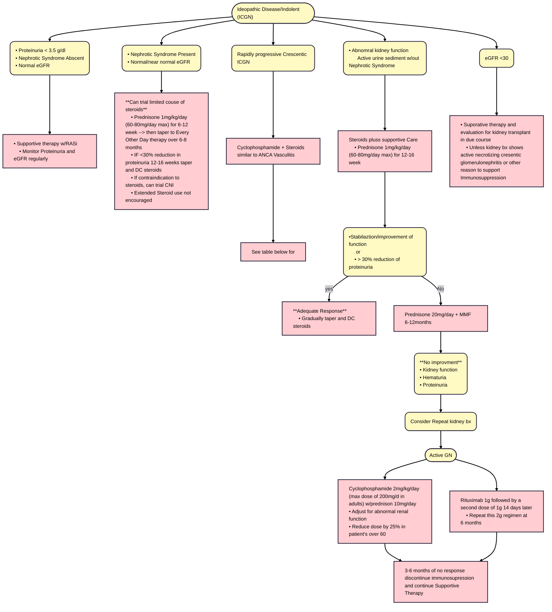

# **Membranoproliferative GN (MPGN)**
## **Overview**
  * MPGN is a descripter of a pattern of injury that can be associated with different disease states
    1. Pattern of glomerular injury characterized by mesangial and endocapillary hypercellularity and double countour formation along the capillary walls
  * Implies that the pathogenic process has been occuring for some time and other patterns of injury may present as well (endocapillary proliferative, mesangioproliferative, and crescent GN)
  * Historically had three classifications, but such nomenclature/classification has fallen out of favor due to rise of immunfluorscent staining, and an increase in knowledege and understanding of how the injury occurs
  * Now classified based on etiopathogenesis
    1. Complement-mediated (C3 glomerulopathy with is further subclassified into dense deposite disease and C3 glomerulonephritis)
    2. Immune complex mediated MPGN
## **Pathophysiology**
  * Pathology:
    1. Glomerular capillary wall remodeling (double countour formation or "train track" appearance
    2. Endocapillary proliferation/hypercellularity
    3. Subendothelial deposits
    4. Pathogenesis: Glomerular capillary injury from deposits mesangial or subendothelial found by EM
    5. Light microscopy
        - Mesangial and endocapillary hypercellularity
        - GBM remodeling (double-contoured or tram-track)
        - Lobular accentuation of the capillary tufts
        - Subepithelial spikes may be present
     6. Immunofixation
        - Pattern may suggest underlying etiology
     7. Electron microscopy
        - Mesagnial and subendothelial deposits
        - less commonly, intramembranous and subepithelial deposits
        - Double countour of basement membrane
        - May suggest undrlying causes
          * Tubuloreticular structures in endothelial cells suggestive of lupus nephritis
          * Fingerprint pattern with cryoprecipitates = cryoglobulinemia
          * Ribbon-like, dark, electron-dense matter inthe lamina densa of GBM = DDD
        - Abscence of any electron dense depositis may suggest a non-immune complex mediated etiology
  * Pathologic entities:
    1. Immune Complex GN (ICGN)
        - Ab triggers reation of classic and lectin pathway (cancers, infection, allergic auto-immune)
        - Systemic autoimmune disease
        - Infection
        - Fibrillary GN
  * Paraprotein-mediated GN
     1. PGNMID (proliferative glomerulonephritis w/monoconol immunoglobulin deposits)
        - paraproteins may impair alternative pathway regulation, leading to monocolonal gammopathy-associated C3G
     3. Cryoglobulinemia 
  * Complement-mediated GN
    1. <ins>*Dysregulation of the alternative pathway*</ins> (genetic or auto-antibioty or monocolonal)
    2. C3GN
    3. DDD
    4. Novel/Rare C4 glomerulopathy
  * Chronic TMA
    1. Membrane double contour, but no proliferation
    2. aHUS/HUS
    3. Drug associated
    4. APS (antiphospholipid syndrome)

```mermaid
---
config:
  theme: redux
---
flowchart TB
    n1(["Classification of MPGN"]) --> n2["Immunoglobulin + complement deposition"] & n3["Complement deposition alone"] & n4["No immunoglobulin or complement deposition"]

    n2@{ shape: rounded}
    n3@{ shape: rounded}
    n4@{ shape: rounded}
    style n1 fill:#E1BEE7
    style n2 fill:#FFCDD2
    style n3 fill:#FFCDD2
    style n4 fill:#FFCDD2
```

```mermaid
---
config:
  theme: redux
---
flowchart TB
    n2["Immunoglobulin + complement deposition"] --> n5["Polyconal (IgM, IgA +/- IgG, C1q, C3, kappa and lambda)"] & n6["Monoclonal (IgG, IgM or IgA, C1q, C3 with light chain restriction)"] & n7["Full-house pattern (IgG, IgM, IgA, C1q, C3, kappa and lambda)"]
    n5 --> n11["Infections"]
    n6 --> n12["Paraproteinemias"]
    n7 --> n13["Autoimmune disease"]

    n2@{ shape: rounded}
    n5@{ shape: rounded}
    n6@{ shape: rounded}
    n7@{ shape: rounded}
    n11@{ shape: rounded}
    n12@{ shape: rounded}
    n13@{ shape: rounded}
    style n2 fill:#FFCDD2
    style n5 fill:#FFF9C4
    style n6 fill:#FFF9C4
    style n7 fill:#FFF9C4
    style n11 fill:#FFE0B2
    style n12 fill:#FFE0B2
    style n13 fill:#FFE0B2
```

```mermaid
---
config:
  theme: redux
---
flowchart TB
    n3["Complement deposition alone"] --> n8["C3GN"] & n9["C4GN"]
    n8 --> n14["C3 Dense Deposite Disease"] & n15["C3GN"]
    n9 --> n16["C4 Dense Deposite Disease"] & n17["C4GN"]

    n3@{ shape: rounded}
    n8@{ shape: rounded}
    n9@{ shape: rounded}
    n14@{ shape: rounded}
    n15@{ shape: rounded}
    n16@{ shape: rounded}
    n17@{ shape: rounded}
    style n3 fill:#E1BEE7
    style n8 fill:#FFF9C4
    style n9 fill:#FFF9C4
    style n14 fill:#FFE0B2
    style n15 fill:#FFE0B2
    style n16 fill:#FFE0B2
    style n17 fill:#FFE0B2
```

## **Clinical Presentation**
  * Variable clinical presentation
  * Hematuria
  * Proteinuria
  * RPGN
  * Chronic deterioration of renal function
  * Labs
    1. Low C3, C4 or both
    2. Abnormal CH50 indicates a complement pathway activation
    3. Work up demonstrated defects in complement pathways, including soluble factor and genetic abnormalities
        - Soluble mediated testing: anti-complement factor antibodie (factor H, B/C3b), nephritic factors (C3NeF, 4NeF, C5NeF), SC5b-9)
        - Genetic testing: CFG, CFI, CFB, C3, THBD, CD40, CFHR 1-5 
## **Drugs and Disease Associated with MPGN/C3GN**
  * ICGN
    1. SLE
    2. RA
    3. Sjogren's
    4. Mixed connective tissues disease
    5. Drug induced
  * Infectous
    1. Bacterial: Post-strep
    2. Viral: HCV (including HCV -mixed cryogloblinemia), HBV
    3. Paracytic: Malaria, schistosomiosis, mycoplasma, leishmaniasis, filariasis, histoplasmosis
  * Fibrillary GN
    1. Polyconol subendothelial deposits 
## **Treatment**
### MPGN on Biopsy

```mermaid
---
config:
  theme: redux
---
flowchart TB
    A(["MGPN Pattern on Bx"]) --> n1["Immunoglobulin + complement deposition"] & n2["Complement deposition alone"] & n3["Negative IgG
    Negative C3"]

    n1@{ shape: rounded}
    n2@{ shape: rounded}
    n3@{ shape: rounded}
    style A color:#000000,fill:#FFF9C4,text-align:left
    style n1 color:#000000,fill:#FFF9C4,text-align:left
    style n2 color:#000000,fill:#FFF9C4,text-align:left
    style n3 color:#000000,fill:#FFF9C4,text-align:left
```

```mermaid
---
config:
  theme: redux
---
flowchart TD
    A(["MGPN Pattern on Bx"]) --> n1["Positive IgG
    pos/neg C3"] & n2["Complement Dominate Pattern"] & n3["Negative IgG
    Negative C3"]
    n1 --> n4(["IgG/C3 mediated"])
    n2 --> n6(["Complement mediated"])
    n3 --> n7["**Evaluate for the following**
    • Antiphospholipid syndrome
    • HUS/TMA
    • Sickle Cell
    • Polycythemia
    • Other"]
    n6 --> n8["Rule Out Infectious causes"]
    n4 --> n9["**Evaluate for the follow**
    • Monocolonal Gammopathy
    • Infection
    • Idopathic"]
    n9 --> n10["• SPEP
• UPEP
• Free light chains
• Heme/onc consult for Bone marow Bx
• Age appropriate Cancer screenging"] & n11["• HBV/HCV
• Chronic bacterial infections
• ASO (strep)
• Recent Hx of infection
• Schistosomiasis
• Echinococcosis
• Malaria"] & n12["• SLE: ANA, ds DNA, C3/C4
    • Sjogren ANA, Anti-Ro/La, RF
    • RA: RF, ANA, Anti-CCP"]
    n8 -- infection present --> n23["Treat Underlying Illness"]
    n8 -- no infection --> n24["<ins>Screen for for Monocolonoal Gammopathy (SPEP/UPEP/FLC) </ins>
    • Complement levels
    • Compliment activation (C3d, Bb, sMAC)
    • Genetic testing"]
    n10 --> n17(["Screening positive"]) & n20(["Screening negative"])
    n11 --> n17 & n20
    n12 --> n17 & n20
    n17 --> n21["Consult appropriate Specialist and Treat Underlying Illness"]
    n20 --> n22(["Ideopathic Disease/Indolent (ICGN)"])
    n24 --> n30["• No Monoclonal Gammopathy
    • moderate to severe disease
    • >1g/d Proteinuria
    • Declining function for at least 6 months"] & n31(["Monoclonal Gammopathy found"])
    n31 --> n32["Consult appropriate Specialist and Treat Underlying Illness"]
    n30 --> n33["• MMF + steroids
    • Supportive Therapy"] & n34["**Recently FDA approved therapy not yet in guidlines**
    • Iptocopan (Factor B inhibtor): approved for C3GN 3/2025
    • Pegcetocoplan (C3 ingibitor): approved for C3GN 7/2025"]
    n1@{ shape: rounded}
    n2@{ shape: rounded}
    n3@{ shape: rounded}
    n8@{ shape: rounded}
    n10@{ shape: rounded}
    n11@{ shape: rounded}
    n12@{ shape: rounded}
    n30@{ shape: rounded}
    style A color:#000000,fill:#FFF9C4,text-align:left
    style n1 color:#000000,fill:#FFF9C4,text-align:left
    style n2 color:#000000,fill:#FFF9C4,text-align:left
    style n3 color:#000000,fill:#FFF9C4,text-align:left
    style n4 color:#000000,fill:#FFF9C4,text-align:left
    style n6 color:#000000,fill:#FFF9C4,text-align:left
    style n7 color:#000000,fill:#FFF9C4,text-align:left
    style n8 color:#000000,fill:#FFF9C4,text-align:left
    style n9 fill:#FFCDD2,color:#000000,text-align:left
    style n10 color:#000000,fill:#FFF9C4,text-align:left
    style n11 color:#000000,fill:#FFF9C4,text-align:left
    style n12 color:#000000,fill:#FFF9C4,text-align:left
    style n23 fill:#FFCDD2,color:#000000,text-align:left
    style n24 fill:#FFCDD2,color:#000000,text-align:left
    style n17 color:#000000,fill:#FFF9C4,text-align:left
    style n20 color:#000000,fill:#FFF9C4,text-align:left
    style n21 fill:#FFCDD2,color:#000000,text-align:left
    style n22 color:#000000,fill:#FFF9C4,text-align:left
    style n30 fill:#FFCDD2,color:#000000,text-align:left
    style n31 color:#000000,fill:#FFF9C4,text-align:left
    style n32 fill:#FFCDD2,color:#000000,text-align:left
    style n33 fill:#FFCDD2,color:#000000,text-align:left
    style n34 fill:#FFCDD2,color:#000000,text-align:left
```

```mermaid
---
config:
  theme: redux
---
flowchart TB
    A(["MGPN Pattern on Bx"]) --> n1["Immunoglobulin + complement deposition"] & n2["Complement deposition alone"] & n3["Negative IgG
    Negative C3"]
    n3 --> n7["`**Evaluate for the following**
    • Antiphospholipid syndrome
    • HUS/TMA
    • Sickle Cell
    • Polycythemia
    • Other`"]
    n9["`**Evaluate for the follow**
    • Monocolonal Gammopathy
    • Infection
    • Autoimmune`"] --> n10["• SPEP
• UPEP
• Free light chains
• Heme/onc consult for Bone marow Bx
• Age appropriate Cancer screenging"] & n11["• HBV/HCV
• Chronic bacterial infections
• ASO (strep)
• Recent Hx of infection
• Schistosomiasis
• Echinococcosis
• Malaria"] & n12["• SLE: ANA, ds DNA, C3/C4
    • Sjogren ANA, Anti-Ro/La, RF
    • RA: RF, ANA, Anti-CCP"]
    n8["Rule Out Infectious causes"] -- infection present --> n23["Treat Underlying Illness"]
    n8 -- no infection --> n24["<ins>Screen for for Monocolonoal Gammopathy (SPEP/UPEP/FLC) </ins>
    • Complement levels
    • Compliment activation (C3d, Bb, sMAC)
    • Genetic testing"]
    n10 --> n17(["Screening positive"]) & n20(["Screening negative"])
    n11 --> n17 & n20
    n12 --> n17 & n20
    n17 --> n21["Consult appropriate Specialist and Treat Underlying Illness"]
    n20 --> n22(["Ideopathic Disease/Indolent (ICGN)"])
    n24 --> n30["• No Monoclonal Gammopathy
    • moderate to severe disease
    • >1g/d Proteinuria
    • Declining function for at least 6 months"] & n31(["Monoclonal Gammopathy found"])
    n31 --> n32["Consult appropriate Specialist and Treat Underlying Illness"]
    n30 --> n33["• MMF + steroids
    • Supportive Therapy"] & n34["`**Recently FDA approved therapy not yet in guidlines**
    • Iptocopan (Factor B inhibtor): approved for C3GN 3/2025
    • Pegcetocoplan (C3 ingibitor): approved for C3GN 7/2025`"]
    n1 --> n9
    n2 --> n8

    n1@{ shape: rounded}
    n2@{ shape: rounded}
    n3@{ shape: rounded}
    n8@{ shape: rounded}
    n10@{ shape: rounded}
    n11@{ shape: rounded}
    n12@{ shape: rounded}
    n30@{ shape: rounded}
    style A color:#000000,fill:#FFF9C4,text-align:left
    style n1 color:#000000,fill:#FFF9C4,text-align:left
    style n2 color:#000000,fill:#FFF9C4,text-align:left
    style n3 color:#000000,fill:#FFF9C4,text-align:left
    style n7 color:#000000,fill:#FFF9C4,text-align:left
    style n8 color:#000000,fill:#FFF9C4,text-align:left
    style n9 fill:#FFCDD2,color:#000000,text-align:left
    style n10 color:#000000,fill:#FFF9C4,text-align:left
    style n11 color:#000000,fill:#FFF9C4,text-align:left
    style n12 color:#000000,fill:#FFF9C4,text-align:left
    style n23 fill:#FFCDD2,color:#000000,text-align:left
    style n24 fill:#FFCDD2,color:#000000,text-align:left
    style n17 color:#000000,fill:#FFF9C4,text-align:left
    style n20 color:#000000,fill:#FFF9C4,text-align:left
    style n21 fill:#FFCDD2,color:#000000,text-align:left
    style n22 color:#000000,fill:#FFF9C4,text-align:left
    style n30 fill:#FFCDD2,color:#000000,text-align:left
    style n31 color:#000000,fill:#FFF9C4,text-align:left
    style n32 fill:#FFCDD2,color:#000000,text-align:left
    style n33 fill:#FFCDD2,color:#000000,text-align:left
    style n34 fill:#FFCDD2,color:#000000,text-align:left
```

### ICGN

```mermaid
---
config:
  theme: redux
---
flowchart TD
    n22(["Ideopathic Disease/Indolent (ICGN)"]) --> n25["• Proteinuria &lt; 3.5 g/dl
     • Nephrotic Syndrome Abscent
     • Normal eGFR"] & n26["• Nephrotic Syndrome Present
     • Normal/near normal eGFR"] & n27["• Abnomral kidney function
      Active urine sediment w/out Nephrotic Syndrome"] & n28["Rapidly progressive Crescentic ICGN"] & n29["eGFR &lt;30"]
    n25 --> n35["• Supportive therapy w/RASi
    • Monitor Proteinuria and eGFR regularly"]
    n26 --> n36["**Can trial limited couse of steroids**
    • Prednisone 1mg/kg/day (60-80mg/day max) for 6-12 week --&gt; then taper to Every Other Day therapy over 6-8 months
    • IF &lt;30% reduction in proteinuria 12-16 weeks taper and DC steroids
    • If contraindication to steroids, can trial CNI
    • Extended Steroid use not encouraged"]
    n27 --> n37["Steroids pluss supportive Care
    • Prednisone 1mg/kg/day (60-80mg/day max) for 12-16 week"]
    n28 --> n38["Cyclophosphamide + Steroids similar to ANCA Vasculitis"]
    n29 --> n39["• Suporative therapy and evaluation for kidney transplant in due course
    • Unless kidney bx shows active necrotizing cresentic glomerulonephritis or other reason to support Immunosuppression"]
    n38 --> n40["See table below for"]
    n37 --> n41["•Stabilaztion/improvement of function
     or
    • > 30% reduction of proteinuria"]
    n41 -- yes --> n43["**Adequate Response**
    • Gradually taper and DC steroids"]
    n41 -- No --> n44["Prednisone 20mg/day + MMF 6-12months"]
    n44 --> n45["**No improvment**
    • Kidney function
    • Hematuria
    • Proteinuria"]
    n45 --> n46["Consider Repeat kidney bx"]
    n46 --> n47(["Active GN"])
    n47 --> n48@{ label: "Cyclophosphamide 2mg/kg/day (max dose of 200mg/d in adults) w/prednison 10mg/day\n    • Adjust for abnormal renal function\n    • Reduce dose by 25% in patient's over 60" } & n49["Rituximab 1g followed by a second dose of 1g 14 days later
    • Repeat this 2g regimen at 6 months"]
    n48 --> n50["3-6 months of no response discontinue immunosupression and continue Supportive Therapy"]
    n49 --> n50
    n25@{ shape: rounded}
    n26@{ shape: rounded}
    n27@{ shape: rounded}
    n28@{ shape: rounded}
    n29@{ shape: rounded}
    n41@{ shape: rounded}
    n43@{ shape: rect}
    n45@{ shape: rounded}
    n46@{ shape: rounded}
    n48@{ shape: rect}
    style n22 color:#000000,fill:#FFF9C4,text-align:left
    style n25 color:#000000,fill:#FFF9C4,text-align:left
    style n26 color:#000000,fill:#FFF9C4,text-align:left
    style n27 color:#000000,fill:#FFF9C4,text-align:left
    style n28 color:#000000,fill:#FFF9C4,text-align:left
    style n29 color:#000000,fill:#FFF9C4,text-align:left
    style n35 fill:#FFCDD2,color:#000000,text-align:left
    style n36 fill:#FFCDD2,color:#000000,text-align:left
    style n37 fill:#FFCDD2,color:#000000,text-align:left
    style n38 fill:#FFCDD2,color:#000000,text-align:left
    style n39 fill:#FFCDD2,color:#000000,text-align:left
    style n40 fill:#FFCDD2,color:#000000,text-align:left
    style n41 color:#000000,fill:#FFF9C4,text-align:left
    style n43 fill:#FFCDD2,color:#000000,text-align:left
    style n44 fill:#FFCDD2,color:#000000,text-align:left
    style n45 color:#000000,fill:#FFF9C4,text-align:left
    style n46 color:#000000,fill:#FFF9C4,text-align:left
    style n47 color:#000000,fill:#FFF9C4,text-align:left
    style n48 fill:#FFCDD2,color:#000000,text-align:left
    style n49 fill:#FFCDD2,color:#000000,text-align:left
    style n50 fill:#FFCDD2,color:#000000,text-align:left
```
### Cyclophosphamide Dosing

|Oral Cyclophosphamide|IV Cyclophosphamide|
|---------------------|-------------------|
|• 2mg/kg/day for 3months|• 15mg/kg at weeks: 0, 2, 4, 7, 10, 13 (16, 19, 21, 24 if required)|
|<ins>Reduction for Age and function</ins>|<ins>Reduction for Age and function</ins>|
| • 60 y/o: 1.5mg/kg/day|• 60 y/o: 12.5mg/kg/day|
| • 70 y/o: 1mg/kg/day| • 70 y/o: 10mg/kg/day|
| • Reduce by 0.5mg/kg/day for eGFR < 30| • Reduce by 2.5mg/kg for eGFR < 30|

### Prednisone Taper
|Week|Patient's <50kg|Patient's 50-70kg|Patient's >75kg|
|----|-----|-------|-----|
|1   |50mg |60mg   |75mg |
|2   |25mg |30mg   |40mg |
|3-4|20mg|25mg|30mg|
|5-6|15mg|20mg|25mg|
|7-8|12.5mg|15mg|20mg|
|9-10|10mg|12.5mg|15mg|
|11-12|7.5mg|10mg|12.5mg|
|13-14|5mg|7.5mg|10mg|
|15-16|5mg|5mg|7.5mg|
|17-18|5mg|5mg|7.5mg|
|19-20|5mg|5mg|5mg|
|21-22|5mg|5mg|5mg|
|23-52|5mg|5mg|5mg|
|>52|Investigator's local practice|Investigator's local practice|Investigator's local practice|

# **C3GN**
## **Overview**
  * Cases of MPGN with sole or dominant C3/C4 staining are classified as primary GN
  * C3 glomerulopathy (C3GN) is a rare entity that commonly presents in an MPGN pattern of injury and can be delinated into two categories: C3 glmerulonephritis (C3GN) and Dense Deposite Disease (DDD)
    1. C3GN
        - Primarly found in adults
        - Older age associateed more w/monocolonal gammopathy and has better outcomes
        - Can be acquired or genetic
        - Commonly induced by C3 nephritic factors
    2. DDD
        - Primarly children and adolescents of both genders
        - Typically very aggressive disease with deterioration of renal function ending ESKD
    3. Typically leads to ESKD
    4. Has high reoccurance in transplant patients and is a cause of early graft failure
  * C4 glomerulopathy is more rare than C3, and has two catorgies similar to C3: C4GN and DDD
## **Pathophysiology** 
  * C3G (C3 Glomerulopathy)
    1. <ins>*Dysregulation of the alternative pathway*</ins> (genetic or auto-antibioty or monocolonal)
        - Leads to uncontrolled glomerular deposition of C3 and cleavage products, resulting in inflammation and progressive kidney diseas
        - May be preceeded by infection --> infection may "unmask" abnormalities in the alternative complement pathway 
    2. Autoantibodies against complement components may be detected In 50% or greater of patients
        - Mainly C3 nephritic fractor (C3NeF), which stabilizes a C3 convertase
        - Other autoantibodies (C5NeF) and antibodies against factor H, factor B, or C3b. 
    3. C3 dominant/only staining of glomerular deposits
    4. Around 50% of cases have and MPGN pattern of injury 
    5. C3GN
        - Mesangial or subendothelial deposits on EM
        - Mesangial deposits: 99%
        - Capillary wall deposits: 97%
        - With humps 49%
        - Post-infectious GN can mimic C3GN (hypocomplementemia and proteinuria tend to normalize and C4d staining is positive in post-infectious GN)
    6. DDD
        - Intramembranous dense deposits: 100%
        - With humps 25%
        - "Saugage-like appearance" on EM due to dense deposition of the basement membrane
## **Sources**
 * [KDIGO GN Guidlines](https://kdigo.org/guidelines/gd/)
 * [C3 glomerulopathies general info](https://pmc.ncbi.nlm.nih.gov/articles/PMC10704907/)
 * [Developing Therapies for C3 Glomerulopathy](https://khi.asn-online.org/uploads/developing_therapies_for_c3_glomerulopathy__report.18.pdf)
 * [Efficacy and Safety of Iptacopan in Patient w/C3 Glomerulopathy](https://www.sciencedirect.com/science/article/pii/S2468024924023222)
 * [Alternative Complement pathway inhibition w/iptacopan for treatment of C3G](https://pubmed.ncbi.nlm.nih.gov/36217526/)
 * [Phase 3 Trial of Pegcetacoplan of Patient with C3G or IC-MPGN](https://journals.lww.com/jasn/pages/articleviewer.aspx?year=2024&issue=10001&article=00313&type=Fulltext)
 * [Safety and Efficacy of Pegcetacoplan](https://pmc.ncbi.nlm.nih.gov/articles/PMC10658235/)
 * [MMF in Combination w/Steroids for C3G Case series](https://pubmed.ncbi.nlm.nih.gov/29326307/)
 * [MMR in C3G and Pathogenic Drivers of the Disease](https://pubmed.ncbi.nlm.nih.gov/32816888/)
 * [C5 Convertase blockade in MPGN](https://www.sciencedirect.com/science/article/abs/pii/S0272638619301003)
 * [Safety and Efficacy of Avacopan in Patients w/C3G](https://pubmed.ncbi.nlm.nih.gov/39392695/)

---
*Last updated: 9/2025 by Ashley Kinder, D.O.*
*Next review: 9/2026*
