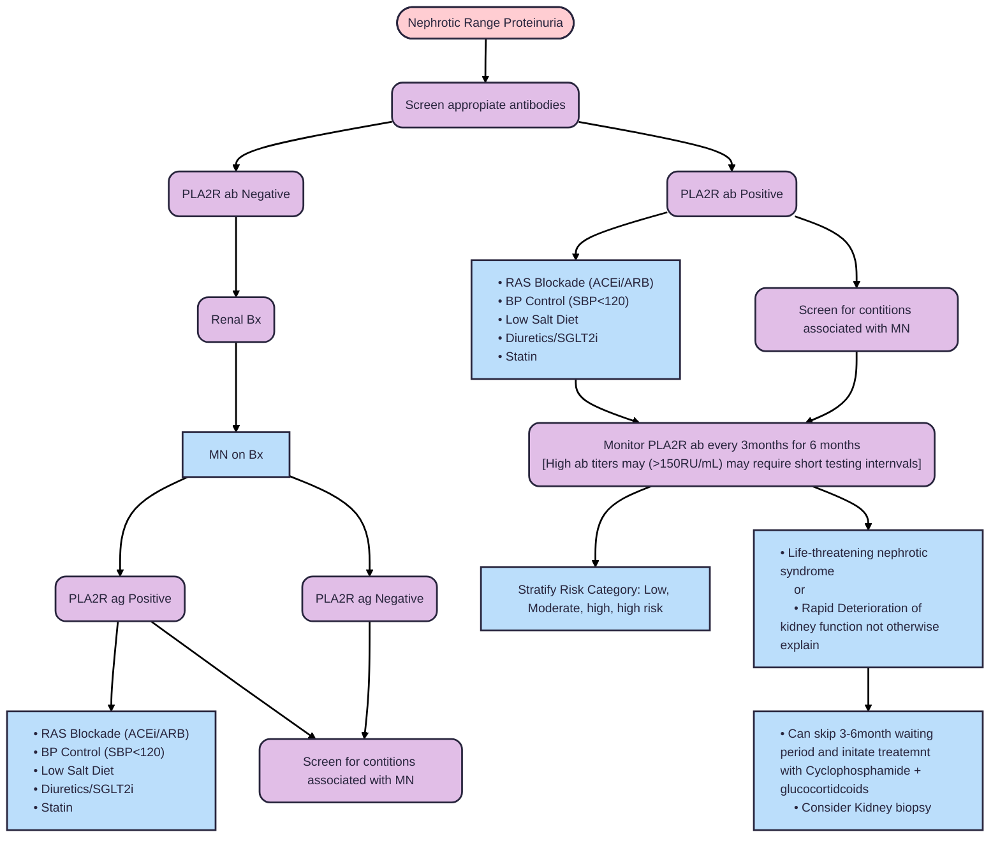
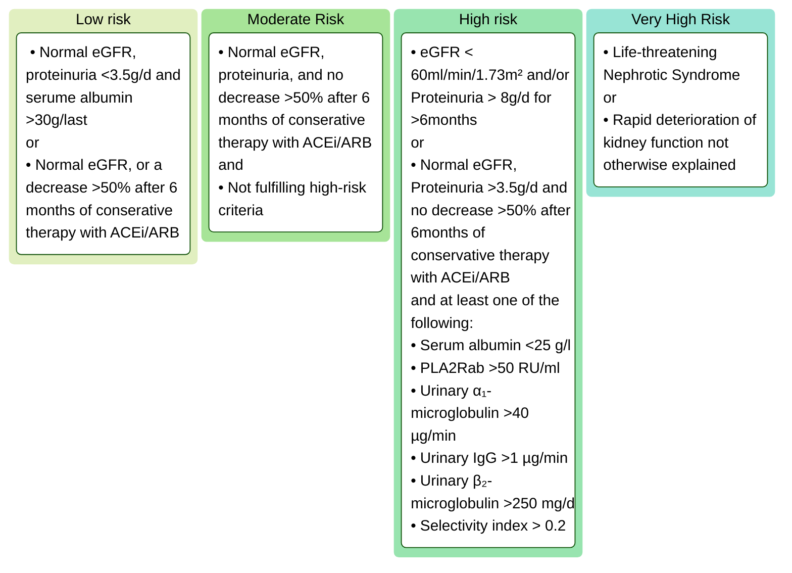
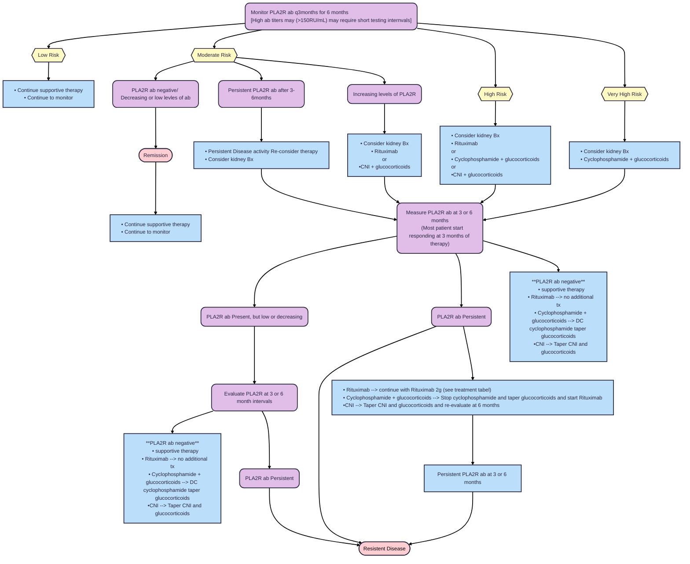
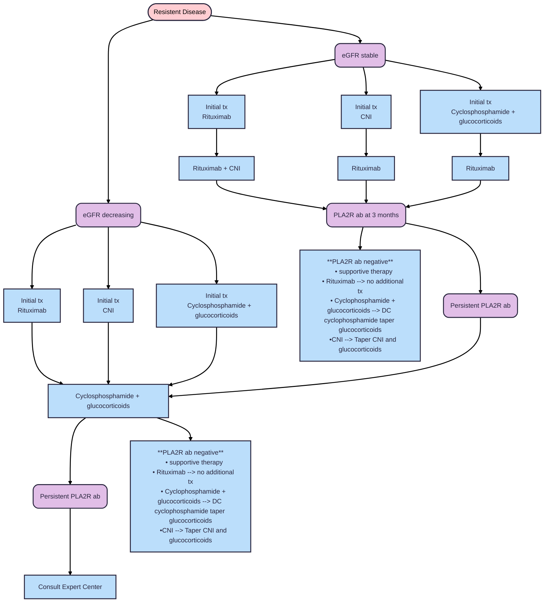

# **Membranous Nephropathy (MN)**
## **Overview**
* Occurs in all ages, but most common in ages 30-60 years old
* Male:Female ratio 2:1
* Risk factors for progression: Male, >60 years of age, high levels of proteinuria, and elevated Cr levels
* Two types: Primary and Secondary
* Primary MN about 70% of cases, Secondaary about 30%
* PLA2R antigen is most comming antigen in Primary MN
* Secondary MN: Autoimmune/CVD, Drug associated, Infection related, Malignancy
    1. Children < 16 years of age commonly: SLE, HBV, congenital syphilis
    2. Adults > 60 years of age commonly: Drug associated and Malignancy
* Biopsy not required for diagnosis PLA2R positive Primary MN
* Spontaneous Remission Relatively common (about 30% of Cases)
* Transplant
    1. occurs most frequently ~2 years post transplant
    2. Is most commonly sub nephrotic 
## **Pathophysiology**
 * Pathology: Subepithelial deposits
    1. Immuncomplex formation in situ of the subepitheial layers of the basement membrane
    2. IgG granulated pattern on IF
    3. Well seen in EM and IF
    4. Spike formation and thickened Basement membrane 
 * Rarely Crescents --> if present should test instigate further testing: ANCA, ANA, Anti-GMB
 * Primary MN Antigen association
    1. PLA2R: Most commen antigen/anti-body in Primary MN, anti-body testing excellent correleatio w/5-10 excess compaired to tissue staining
    2. THSD7A: No antibody testing available at this time, also found in secondary and should invoke age approiate cancer screenings
 * Secondary MN Antigen association
    1. Exostosin 1/Exostosin 2 (EXT1/EXT2): ofent associated with Autimmune disease
    2. NELL 1: most heterogenous of all antigens, associated in many disease states (drugs, malignancy, autoiummune, infection), should invoke age approiate cancer screenings
    3. THSD7A: can be associated with malignancy
    4. NDNF: associaged with syphylsis
    5. PCSK6: NSAID
    6. Protocadherin 7: primary older patients, minimal complement activation and high rates of spontaneous remission
    7. FAT1: associated with stemcell transplant patients, progressive and can re-occur in allograft
    8. Semaphorin 3b: pediatric patients w/onset <2 years old
 * Most common Secondary MN found in SLE patients
## **Clinical Presentation**
 * Proteniuria --> 75% of cases fully nephrotic
 * Normotensive
 * Normal/perserved renal function
 * 50% of cases with microscopic hematuria
## **Drugs and Diseases Associated with Membranous**
 * Drugs
    1. Gold salts
    2. Mercury (can occasionaly be found in creams meant to lighten skin)
    3. Penicillamine
    4. Bucillamin
    5. Catopril (sulfhydryl group)
    6. Lipoic Acid (found in supplaments)
    7. NSAID (assoicated with PCSK6 antigen)
    8. Tiopronin
    9. Trimethadione
 * Malignancy
    1. Mainly Carcinomas
    2. MC lung (highly associated with older patients who have a smoking history)
    3. GI 
    4. Prostate 
    5. Breast
 * Infections
    1. HBV
    2. Syphilis
    3. Filariasis
    4. HCV
    5. Hydatid disease (parasitic infection caused by the larval stage of a tapeworm)
 * Autiommune
    1. SLE
    2. RA
    3. Sjogren
    4. Mixed connective tissues
    5. Graves
    6. Hashimoto's
 * Other
    1. Allogenic hematopoietic SCT
    2. IgG4RD
    3. Guillain Barre
    4. Chronic inflammatory Demyelinatio polyneuropathy (CIDP)
    5. Sarcoidosis
    6. Renal Vein Thrombosis 
## **Deffinitions of Treatment Response**
 * No formal definition of Resistent Disease currently accepted. Current guidelines put forth that patient's with persistent/increasing levles PLA2R ab after 1st round of immunotherapy be treated as Resistent
 * Resistance Disease in PLA2R negative patient's with primary MN is difficult to define
    1. Persistent Nephrotic Syndrome
    2. Or increased, but still reduced serum albumin levels as markers for resistent disease
  * Best Model for predicitive of response to treatment is PLA2R ab titer w/serum Albumin at 3months of treatment 
## **Treatment**
### General Information
 * It is reasonable to wait 6 months, while patient is on maximal anti-proteinuric therapy, before starting immunosupressive therapy due to high rates of spontaneous remission.
 * PLA2R-ab testing with ELIZA and/or IFA is cleared by FDA for aid in diagnosis only. Use for PLA2R-ab testing in monitoring is off lable use, though used extensively in guidline recomendations
 * Proteinuria can persist for 12-24 months after start of treatment
 * High rates of thrombosis; [Prophylaxis page](Prophylaxis.md)
 * When to Biopsy
    1. Unusual clinical course; rapid decrease in eGFR
    2. Serological abnormalities (positive ANA, ect.)
    3. Unresponsive to immunosuppressive therapy and progressive kidney injury
    4. Persistent nephrotic syndrome despite disappearance of PLA2Rab
### Initial Investigation and Management

### Risk Categories

### Treatment Regimens 
 * Cyclophosphamid (cyclical)(Modified ponticell)
    1. Methylprednisolone 1g IV for 3 consecutive days at start of Month 1, 3, and 5
    2. Prednisone 0.5mg/kg/day in months 1, 3, 5, after finishing doses of methylprednisolone
    3. Cyclophosphamide 2.5mg/kg day in months 2, 4, and 6
 * Cyclophosphamide (continuous)
    1. Methylprednisolone 1g IV for 3 consecutive days at start of Month 1, 3, and 5
    2. Prednisone 0.5mg/kg/day every other day in months 1-6
    3. Cyclophophosphamide 1.5mg/kg/day in months 1-6
 * Rituximab
    1. Rituximab 1g IV administered twice w/in 2 weeks or
    2. Rituximab 375mg/m2 given 1-4 times at weekly intervals 
 * Tacrolimus
    1. Tacrolimus 0.05-0.1mg/kg/day
    2. Target trough 3-8ng/mL(3.7-9.9nmol/l)
    3. Duration of 12 months
 * Cyclosporine
    1. Cyclosporine 3.5mg/kg/day
    2. Target trough level 125-225 ng/ml (104-187nmol/l)
### Initial immunosupressive therapy

### Resistent disease

### Comming Therapies
  * Obinutuzumab vs tac in Majesty trial --> Primary partial complet date December 2025, Expected completion Date December 2027
  * Combo therapy with short course cyclosporin and glucocorticoids with Rituximab 
## **Sources**
* [KDIGO GN Guidlines](https://kdigo.org/guidelines/gd/)
* [Serology based approach](https://pubmed.ncbi.nlm.nih.gov/27777266/)
* [SGLT2 in primary and secondary glomerulonephritis](https://pubmed.ncbi.nlm.nih.gov/37550217/)
* [Rituximab for Severe Membranous Nephropathy](https://pubmed.ncbi.nlm.nih.gov/27352623/)
* [Rituximab or Cyclosporine in Treatment of Membranous Nephropathy](https://pubmed.ncbi.nlm.nih.gov/31269364/)
* [Alternating treatment with corticosteroids and cyclophosphamide superior to tx with tacrolimus and rituximab](https://pubmed.ncbi.nlm.nih.gov/33166580/)
* [Comparison of Obinutuzumab and Rituximab for Treating Primary MN](https://pubmed.ncbi.nlm.nih.gov/39207845/)
* [Combination Rituximab, and low dose cyclophosphamide and prednisone for Primary Membrandous](https://pubmed.ncbi.nlm.nih.gov/34174365/)
---
*Last updated: 9/2025 by Ashley Kinder, D.O.*
*Next review: 9/2026*
