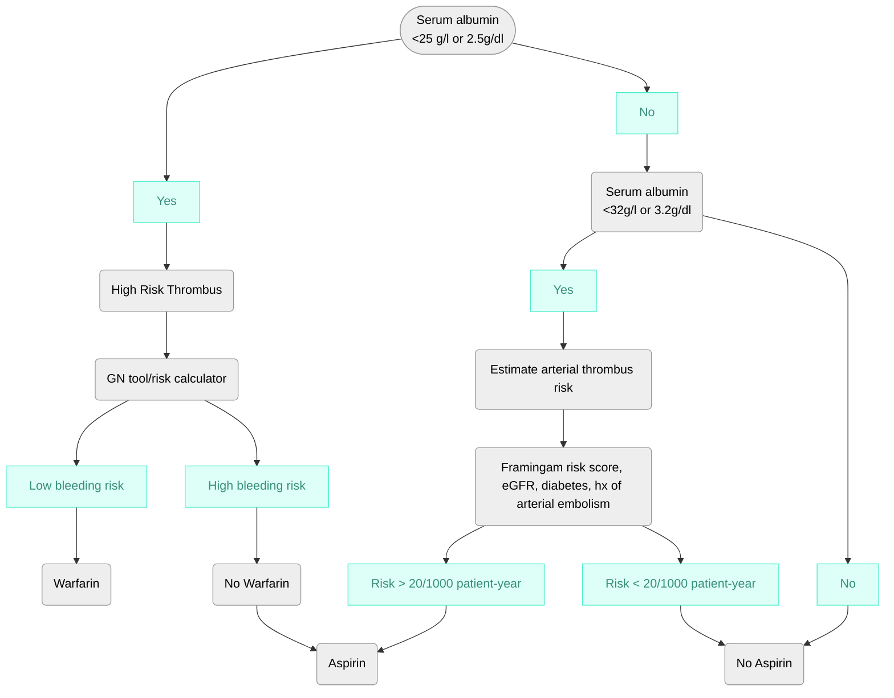

## **Anticoagulation**
### **General Information**
* Risk of thrombosis is higher with patients with Nephrotic Syndrome than the general population
* DVT and Renal Vein thrombosis are the most common, with Pulmonary embolus common as well
* Thrombotic events are most common with Membranous Nephropathy, but can occur with other Nephrotic diseases
* Degree of Proteinuria and serum albumin are best predictors of thrombotic risk
* Additional risk factors: prior thrombosis, genetic predisposition, antiphospholipid antibodies, immobility, obesity, malignangcy, pregnancy, or surgery
* Heparin and Warfarin are medications or choice for prophylaxis and/or treatment of thrombosis
    1. No studies currently available comparing DOAC or LMW Heparin
    2. DOAC are heavily albumin-bound and dosing in low albumin states has not been studied
### **Anticoagulation in Nephrotic syndrome**
* For thromboembolic events Full dose anticoagulation is required for 6-12 months and/or the duration of the nephrotic syndrome
    1. Venous thrombosis
    2. Arterial throbosis
    3. PE
    4. Nonvalvular Atrial Fibrillation
* Prophylactic full dose anticoagulation should be considered if
    1. Serum albumin < 20-25g/l
    2. BMI > 35 kg/m2
    3. Genetic disposition for thrombosis
    4. Heart Failure NYHA class III or IV
    5. Recent orthopedic or abdominal surgery
    6. prolonged immobilization
* Relative or absolute contraindications to prophylactic anticoagulation
    1. Patient preference/ability to adhere to medications
    2. Hx of bleeding
    3. CNS lesion prone to hemorrhage
    4. Genetic mutations influencing warfarin metabolism
    5. Frailty
  

*[GN tool/Risk Calculator](https://www.med.unc.edu/gntools/bleedrisk.html)
## **Vaccinations**
 * Pneumococcal Vaccinatation
   * Patient and entire household should recieve both 7vPCV and 23vPPV
* Annual Influenza
* All live Vaccinations (MMR, Varicella, rotavirus, yellow fever) should be deferred or avoided until prednisone dose is < 20mg/d or immunosuppressive agents have been stopped for at least 1-3 months
* Patient recieving complement antagonists should have:
    * Menigococcal Conjugate Vacine
        1. Depending the brand and age of patient may require 2, 3, or 4 doses
        2. Booster dose every 5 years for the duration of complement inhibitor therapy
    * Serogroup B menigococcal Vaccine
        1. Requires 3 doses
        2. Booster doses one year after completion of series and every 2-3 years therafter for duration of complement inhibitor therapy
    * Shingrix vaccine is safe and should be given to these patients (immunosuppression may reduce its efficacy)
## **Antibiotics in setting of Immunosuppression**
 * Bactrim (TMP-SMX)
   * Should be given while patient on high dose prednisone or other immunosuppressive agents (rituximab, cyclophosphamide)
   * Atovaquone or pentamidine may be substituted for patient's with sulfa-allergy --> recommendation based on immunosuppressed patient w/out glomerular disease
## **Other**
 * H2 blockers or PPI while on steroids --> prevention of Peptic ulcer disease
 * Limit UV exposure and appropiate use of Broad spectrum sunscreen
 * Effective contraception
## **Sources**
* [KDIGO GN Guidlines](https://kdigo.org/guidelines/gd/)
* [CDC Menigococcal Vaccination](https://www.cdc.gov/meningococcal/hcp/clinical-guidance/complement-inhibitor.html?CDC_AAref_Val=https://www.cdc.gov/meningococcal/clinical/eculizumab.html)
